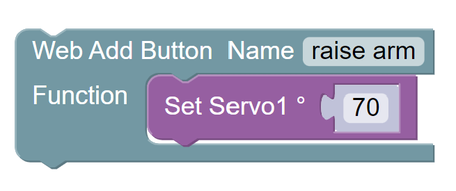
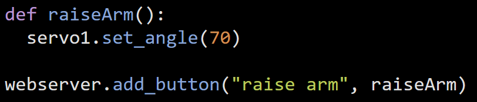

Creating Custom Buttons for the Web Server
==========================================

In the last section, you learned how to remotely control your XRP using the built-in directional buttons. 
in addition to those, you can also create custom buttons that can run any command you want!

you can make a button run any function you can write, so get creative!