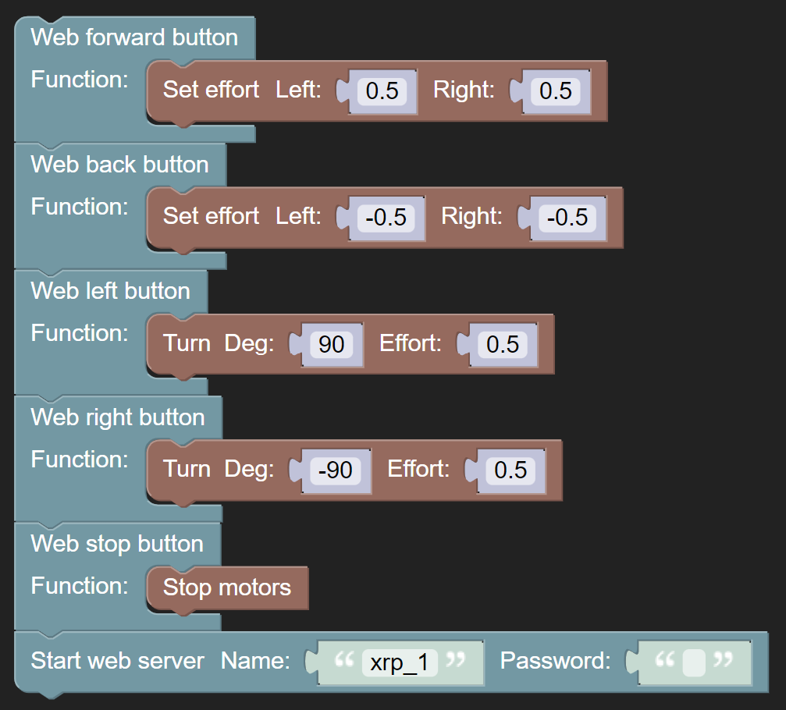
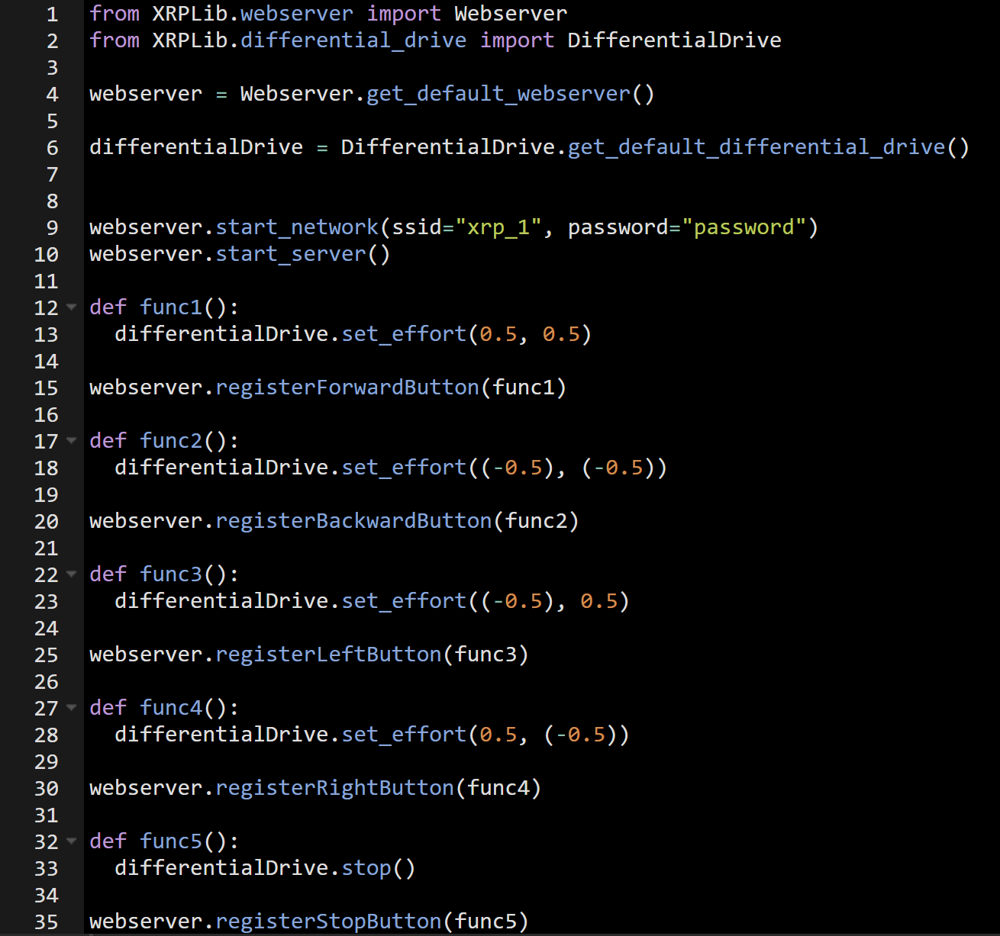

Remotely Controlling your XRP
=============================

you've learned how to move the XRP with basic drive commands. 
But using the web server to remotely control the XRP gives you much more freedom.

The XRP Web server has built in buttons to go forward, back, left, right, and stop. 
All you need to do is add whatever command you want into that button, so when pressed, the web served will run that command.

here is an example:

with this code, you can wirelessly drive your XRP!