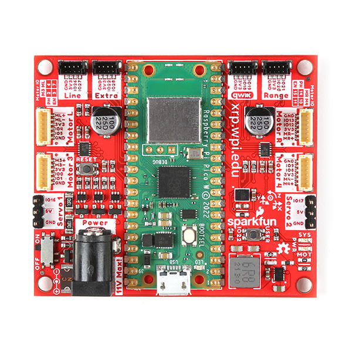
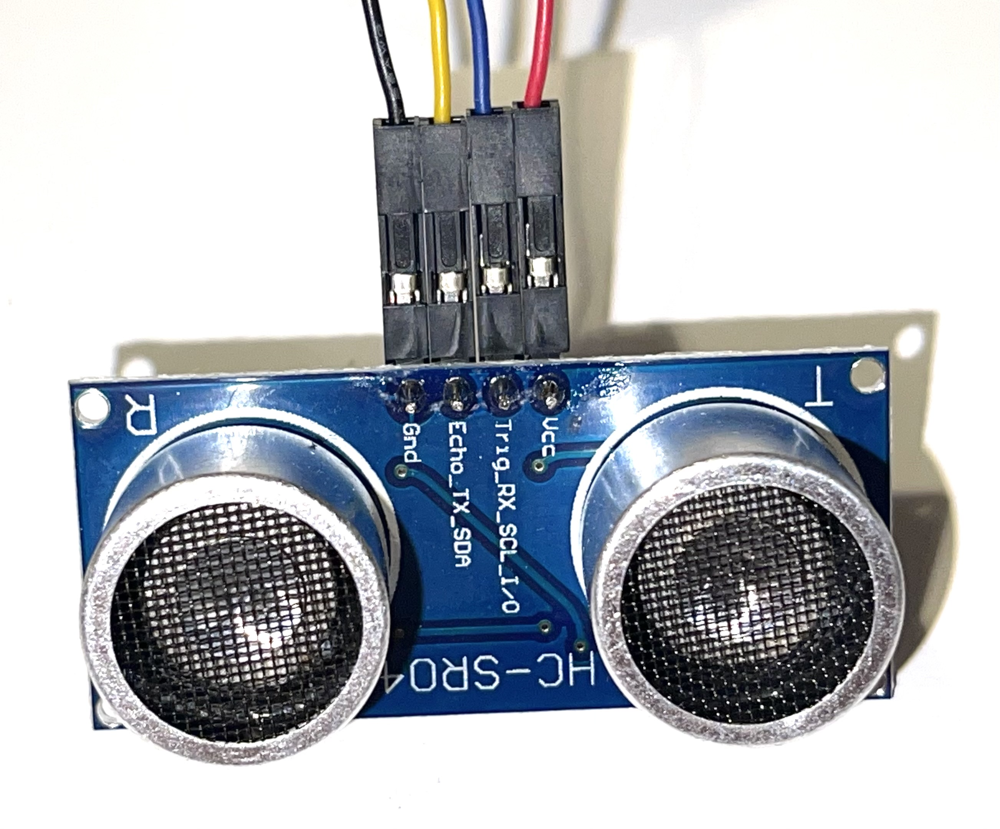

======================
Building the XRP robot
======================

Assembling the XRP robot is easy, but be sure to follow the steps here to be sure that
the wiring is correct and all the pieces are added correctly to the chassis.

Below is a video provided by SparkFun Electronics showing how to assemble the robot followed
by a step by step set of written instructions below.

.. youtube:: G7gfPi7XHuA

|
|

The XRP kit (1:22)
==================

The XRP kit contains all the parts you need to assemble and use your robot.
You only need to supply 4 AA Batteries (preferably rechargeable) and a micro USB
cable to connect your computer to the robot. The contents of the kit are shown
to help you identify the parts during assembly.

**Robot chassis**
    .. image:: media/Assembly/chassis.jpeg
        :width: 200
        :alt: Robot Chassis that holds all the components

The chassis is a single-piece design that holds all of the robot components. It is designed
with a rail system that is designed to make adding additional components easy and without
the need for tools. All the robot parts simply snap onto the chassis to make assembly as
simple as possible. You can also 3D print your own parts to attach to the chassis.

**Robot controller**

    .. image:: media/Assembly/robot_controller.jpeg
        :width: 200
        :alt: Robot controller circuit board

The robot controller has the RP2040 microprocessor that reads the sensors inputs, runs
the Python or Blockly program and drives the actuators (motors). It also has additional
components to sense accelerations and headings of the robot, and communicate over WiFi
with your laptop or phone.

**Electronics parts**

    .. image:: media/Assembly/electronics_parts.jpeg
        :width: 200
        :alt: Electronics parts background

The components in the bag of elctronics parts will each be shown individually below.

**Motors and cables**

    .. image:: media/Assembly/motors_and_cables.jpeg
        :width: 200
        :alt: Robot drive motors and cablese

The motors are used to drive the robot and are attached to motor controller through
the associated cables.

**Battery case**

    .. image:: media/Assembly/battery_case.jpeg
        :width: 200
        :alt: Battery case for AA cells

The battery case holds 4 AA batteries. You can use any standard alkaline cells but
rechargeable cells are prefered so that you don't have to keep replacing them as
they run out of energy.

**Ultrasonic rangefinder**
    .. image:: media/Assembly/ultrasonic.jpeg
        :width: 200
        :alt: Ultrasonic rangefinder

The ultrasonic wire has two power wires labeled Vcc (red wire) and Gnd (black wire). It also has two
additional connections that operate the sensor and get range data. These are trig (blue wire) and
echo (yellow wire). A common mistake when wiring this sensor is to get these two wired incorrectly.

**Rangefinder bracket**
    .. image:: media/Assembly/rangefinder_bracket.jpeg
        :width: 200
        :alt: Ultrasonic sensor bracket

**Reflectance sensor**
    .. image:: media/Assembly/reflectance_sensor.jpeg
        :width: 200
        :alt: Reflelctance sensor for following or finding lines the robot drives over

**Reflectance sensor bracket**
    .. image:: media/Assembly/reflectance_bracket.jpeg
        :width: 200
        :alt: Reflectance sensor bracket

**Sensor cables**
    .. image:: media/Assembly/sensor_cables.jpeg
        :width: 200
        :alt: Cables for rangefinder and line follower sensors

These cables connect the rangefinder and line following sensors to the robot controller.
**When installing these on the sensor end, you must be careful to install the wires correctly,
so be sure to carefully read the instructions when attaching them.** Miswiring is the motors is the most
common cause of problems when assembling the XRP robot.

**Tires (o-rings)**
    .. image:: media/Assembly/tires.jpeg
        :width: 200
        :alt: O-rings to be used as tires over the wheels

These o-rings are used to form tires to slip over the plastic wheels to give the robot
more traction, especially on smooth surfaces.

**Servo motor**
    .. image:: media/Assembly/servo.jpeg
        :width: 200
        :alt: Servo motor for the robot arm

**Servo arm**
    .. image:: media/Assembly/servo_arm.jpeg
        :width: 300
        :alt: Servo arm for lifting objects

**Servo bracket**
    .. image:: media/Assembly/servo_bracket.jpeg
        :width: 200
        :alt: Servo bracket for mounting servo on back of robot

The servo is a special type of motor such that when programmed with a position
the shaft will automatically move to the specified angle. This is used to power the arm
on your robot it can move to predetermined angles all by itself.

**Casters**
    .. image:: media/Assembly/casters.jpeg
        :width: 200
        :alt: Nylon balls to use as front wheel casters

The casters simply provide a low friction contact point for the front of the robot to 
allow the two rear drive wheels to easily steer the robot forwards, backwards, or any angle.

Assembling the XRP Robot
========================

Assembling the XRP robot can be done without the use of tools with the optional exception of screwing
the servo arm to the servo. The total process should take about 15 minutes, especially once you
understand how it goes together.

Each of the following sections has a time reference for the video at the top of this page so you
can see how to assemble that part. We suggest that you view the entire video before starting the
assembly so you can get a good overview of how it goes together.

Inserting the casters into the chassis (2:07)
---------------------------------------------

    .. image:: media/Assembly/installing_casters.jpeg
        :width: 300
        :alt: Nylon casters inserted into the chassis

Install the white front casters (balls) into the chassis by pushing them into place.
Once they are installed, the casters should rotate freely.

Inserting the robot controller into the chassis (2:13)
------------------------------------------------------

.. note::
 
    If you look at the connectors on the edge of the controller board labeled "Line", "extra", "qwiik", and "range"
    have very small pieces of tape covering the openings. Remove the tape from all four connectors before inserting
    the board in the chassis.

Insert the robot controller circuit board into the chassis as shown in the following picture.
Observe the orientation of the board where the battery connector (5) istowards the back of the
robot as shown. Also the top corners of the board are inserted part way into the corner
pockets as shown at (1) and (2). The clips in the chassis (3) and (4) are designed to hold the chassis
in place when it is pushed in.

    .. image:: media/Assembly/inserting_controller_1.jpeg
        :width: 300
        :alt: First step in installing the controller is to push in the top corners

Then push down and foward on the back edges of the board so that the front corners
are completely seated in the pocket as shown at (1) and (2) and the board snaps down as shown at (3) and (4)
in the following photograph. It might be helpful to view this part of the assembly in the video
from the top of this page.

    .. image:: media/Assembly/inserting_controller_2.jpeg
        :width: 300
        :alt: Second stem in stalling the controller by pushing it forwards and down into place

Adding the motors
-----------------
The red hobby motors supplied with the kit include encoders (sensors to measure wheel rotation) to
make it easy to program the robot to drive for specific distances and speeds. This will give your
robots more control and accuracy as your are writing progams to operate it.

Putting the tires onto the wheels (2:30)
----------------------------------------

The tires are rubber o-rings that slip into the groove on the outside rim of the wheel. Simply stretch
the o-ring to get it to move into place. These will provide friction when the robot is driving,
especially on smooth surfaces.

    .. image:: media/Assembly/tires_on_wheels.jpeg
        :width: 300
        :alt: Photo of one tire installed and one on top of the wheel

Putting the wheels onto the motors (2:47)
-----------------------------------------

The wheels press fit onto the white motor shafts. Notice that the motor shafts have two flat sides
that correspond to the flat edges in the center of the wheel. The wheel is pressed over the
motor shaft so that the center part of the wheel that sticks out is closest to the motor body and
that the wheel is pressed all the way onto the motor shaft.

    .. image:: media/Assembly/wheel_and_motor.jpeg
        :width: 200
        :alt: The wheel and motor showing the shaft flat sides and the corresponding wheel shape

    .. image:: media/Assembly/wheel_mounted.jpeg
        :width: 200
        :alt: The wheels mounted on the motors

Connecting the motor cables to the motors (3:02)
------------------------------------------------

The motor cables connect the motor to the robot controller so that it can drive the drive the motors
and receive data from the motor encoder sensors that provide position and speed information for
your robot program. This encoders all the robot to drive at a desired speed and drive for a desired
distance.

The wider connector on the cable is inserted into the motor. Notice that pins (wires) on the motor
connector are closer to one side than the other. Similarly, the holes on the connector attached to the
cable are closer to one side. 

    .. image:: media/Assembly/cables_on_motors.jpeg
        :width: 200
        :alt: The cables attach to the motors by inserting the connectors

Installing the motors into the chassis (3:17)
---------------------------------------------

The motors snap into the chassis from the bottom once the wheels and cables are installed. The motor
is oriented so that the wheel goes through the slot on the chassis as shown in the picture.
Ideally you should push the wires from the motor through the opening in the chassis to the top of the
chassis so they can be attached to the robot controller. Then seat the end of the motor opposite the
cable end, then snap the wheel side of the motor into place. Repeat for both motors.

    .. image:: media/Assembly/motor_half_installed.jpeg
        :width: 200
        :alt: Motor is inserted from the cable end first

    .. image:: media/Assembly/motor_fully_installed.jpeg
        :width: 200
        :alt: Motor is fully seated in the chassis

Photo of the controller board
-----------------------------
Many of the following instructions require attaching cables to the connectors on the
controller board on the robot. The printing on the board identifying the purposes of
each of the connectors and the pins is very small to fit on the small board. To make
assembly easier, refer to the following photograph of the board if needed.

Connecting the motor cables to the robot controller (3:50)
----------------------------------------------------------

The motor cables are connected to the white connectors on the side of the chassis labeled Motor L and Motor R
for the left and right motor cables.

    .. image:: media/Assembly/left_motor_cable.jpeg
        :width: 200
        :alt: Left motor cable inserted in the controller board

    .. image:: media/Assembly/right_motor_cable.jpeg
        :width: 200
        :alt: Right motor cable inserted in the controller board

Installing the battery pack (3:59)
----------------------------------
The battery pack is installed by:

1. Inserting the cable through the cutout in the battery pack area in the chassis.
2. Pushing the edge of the battery pack against the fingers in the chassis which hold it in place.
3. Push the battery pack in place into the robot chassis so that it is full seated.

    .. image:: media/Assembly/battery_pack_cable.jpeg
        :width: 200
        :alt: Cable inserted through the hole before inserting battery pack

    .. image:: media/Assembly/battery_pack_inserted.jpeg
        :width: 200
        :alt: Battery pack being inserted into the chassis.

Adding the battery cover (4:15)
-------------------------------

The battery cover is very easy to install, just line up the two tabs on the battery cover with the two
slots in the chassis just outside of the battery case. Then the clip snaps into place as you push the
battery cover into place.

    .. image:: media/Assembly/battery_cover_pegs.jpeg
        :width: 200
        :alt: Battery cover tabs inserting into the chassis slots
    
    .. image:: media/Assembly/battery_cover_all.jpeg
        :width: 200
        :alt: Battery cover fully seated waiting to be snapped into place

Adding the Line Following Sensor
--------------------------------
The line following sensor can detect lines on the driving surface that have a different reflectivity.
These are typically used in robot applications to follow lines or locating interesting places on a
board or mat. It has two pairs of LEDs and photo sensors to emit infrared light and measure the
reflected brightness.

Connecting the cable to the line follower (4:32)
------------------------------------------------
The sensor cable is connected to the line following (reflectance) sensor as shown in the picture
below. Be sure to observe the order and color of the wires connecting to the sensor. The connectors
simply push over the sensor pins. Be sure that they are fully seated as shown in the picture and video
to ensure a good connection.

    .. image:: media/Assembly/reflectance_wiring.jpeg
        :width: 200
        :alt: The cable attached to the reflectance sensor showing the order of the individual wires

Inserting the line follower into the bracket (5:04)
---------------------------------------------------
The reflectance sensor is inserted into the bracket as shown in the picture below. Also look at the side
view of the assembly to see how the sensor is correctly positioned in the bracket.

    .. image:: media/Assembly/reflectance_in_bracket.jpeg
        :width: 200
        :alt: Reflectance sensor inserted into the bracket
    
    .. image:: media/Assembly/reflectance_side_view.jpeg
        :width: 200
        :alt: Side view of reflectance sensor showing how it fits into the bracket

Attaching the reflectance sensor to the chassis (5:17)
------------------------------------------------------
The reflectance sensor is installed on the chassis as shown int he picture below. The ball end of the
bracket is inserted into the slot in the front rail.

    .. image:: media/Assembly/reflectance_sensor_on_chassis.jpeg
        :width: 200
        :alt: The reflectance sensor attached to the chassis

Adding the ultrasonic rangefinder
---------------------------------
The ultrasonic rangefinder uses sound to measure the distance to objects in front of the sensor.
An ultrasonic (inaudible high frequency) short sound is sent from one of the transducers which
is reflected back by nearby objects and received by the second transducer. The time of the
sound round-trip is measured to determine distance to nearby objects.

Attaching the bracket to the chassis (5:27)
-------------------------------------------
The rangefinder bracket is attached to the front of the chassis just above the reflectance sensor
as shown in the picture below.

    .. image:: media/Assembly/rangefinder_bracket_on_chassis.jpeg
        :width: 200
        :alt: Rangefinder bracket attached to the chassis

Wiring the rangefinder (5:39)
-----------------------------
The rangefinder is wired by attaching the four wires from the sensor cable to the pins on the rangefinder
as shown in the picture below. Be sure to connect the wires to the pins in the right order.

Attaching the rangefinder to the bracket (6:06)
-----------------------------------------------
Attach the rangefinder to the bracket as shown in the picture below.

    .. image:: media/Assembly/rangefinder_on_chassis.jpeg
        :width: 200
        :alt: Rangefinder mounted on the bracket and the chassis

Connecting the cables for the line follower and rangefinder (6:14)
------------------------------------------------------------------
The cables from the reflectance sensor (line follower) and the rangefinder are connected to
the connectors on the controller board. Notice that there are labels on the board for each
of these cables to help you get them into the right connectors. The line follower cable goes
into the connector labeled Line and the rangefinder goes into the connector labeled Range.
It is a good idea to put a small loop in the wire that can be tucked into the chassis
before connecting it to help keep the wiring neat and less likely to get snagged.

    .. image:: media/Assembly/line_connector.jpeg
        :width: 200
        :alt: The line follower cable inserted into the connector on the controller board
    
    .. image:: media/Assembly/range_connector.jpeg
        :width: 200
        :alt: The range finder cable inserted into the connector on the controller board

Attaching the servo
-------------------
The servo is used to rotate the arm to the desired position. It has the advantage
over a normal motor in that it has sensors inside of it to allow it to move to
a desired position that you can program.

Inserting the servo horn into the robot arm (6:37)
--------------------------------------------------
The servo horn is the small white plastic arm that attaches to the servo by pressing onto the
servo shaft. There are several servo horns that come with the servo accessories. The one that
you should use has a hole for attaching to the servo shaft at one end, and a small arm at the
other end. It gets installed into the slot at the end of the larger black servo arm as shown
in the picture below and the video. **Be sure to install the servo arm so that it is
oriented as shown in the photo, in particular make sure that the mounting flange is
facing the correct direction**. 

    .. image:: media/Assembly/servo_horn_install.jpeg
        :width: 200
        :alt: Servo horn (white piece) from the bag of servo accessories is installed in the servo arm

Mounting the arm to the servo (6:58)
------------------------------------
The servo arm simply presses onto the white shaft on the servo. The servo shaft only has about 180
degrees of rotation so it's important to install the arm so that it can move through its full range
of motion while mounted on the robot. Holding the servo so that it's flat with the wires coming out to
the left, the arm should be mounted so that it has 180 degrees of motion from front to back. That is
the arm will never travel below the level of the servo body. You can see how this is done by looking
at the video at the indicated time stamp.

Mounting the servo to the servo bracket (7:19)
----------------------------------------------
The servo snaps into the servo bracket as shown in the photo below.

    .. image:: media/Assembly/servo_on_bracket.jpeg
        :width: 200
        :alt: The servo mounted in the bracket ready to snap onto the robot

Attaching the servo and bracket to the robot chassis (7:29)
-----------------------------------------------------------
The servo is attached to the robot by first inserting the ball end of the bracket into the upper
slot on the back rail, then snapping the bottom part of the bracket over the bottom part of the rail.

    .. image:: media/Assembly/ball_end_of_servo.jpeg
        :width: 200
        :alt: Inserting the ball end of the servo bracket into the slot into the top slot on the chassis rail

    .. image:: media/Assembly/top_servo_bracket.jpeg
        :width: 200
        :alt: Pushing the bottom part of the servo bracket over the bottom part of the chassis rail

Connecting the servo cable to the robot controller (7:53)
---------------------------------------------------------
The servo cable is connected to the slot labeled Servo 1 on the robot controller board as shown in the
photo below. Be sure to connect it as shown with the black wire connecting to the Gnd terminal on the Robot
Controller board.

    .. image:: media/Assembly/servo_cable_installed.jpeg
        :width: 200
        :alt: The servo cable is installed into the controller board. Make sure to connect it as shown.

Troubleshooting the robot build
===============================
Generally the build of the robot is very strightforward, but from feedback we have compiled this section
that describes some of the common issues we have seen as people are building the XRP.

Rangefinder or the line following sensors don't work in the Installation Vefrificaton Test 
------------------------------------------------------------------------------------------
It is very easy to accidentally attach the rangefinder and line following sensor cables to the
wrong connectors on the controller board. Be sure to verify that the rangefinder is in the
connector marked "Range" and the line following sensor is in the connector marked "Line".

If the connectors are reversed and you have to remove them, **be sure to only remove the connector
by pulling on the plastic shell**. Do not pull on the wires as you might accidently pull them out
of the connector.