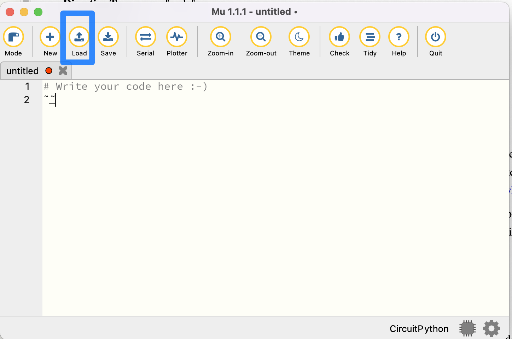
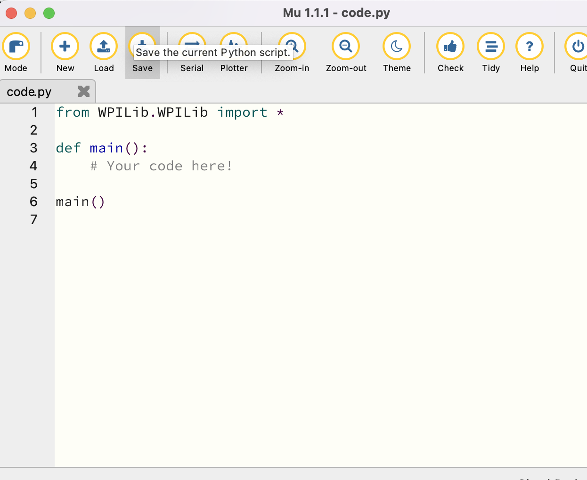
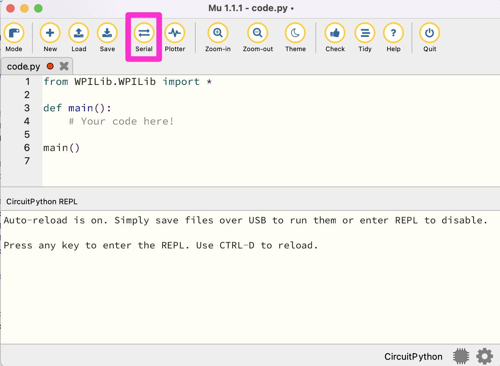
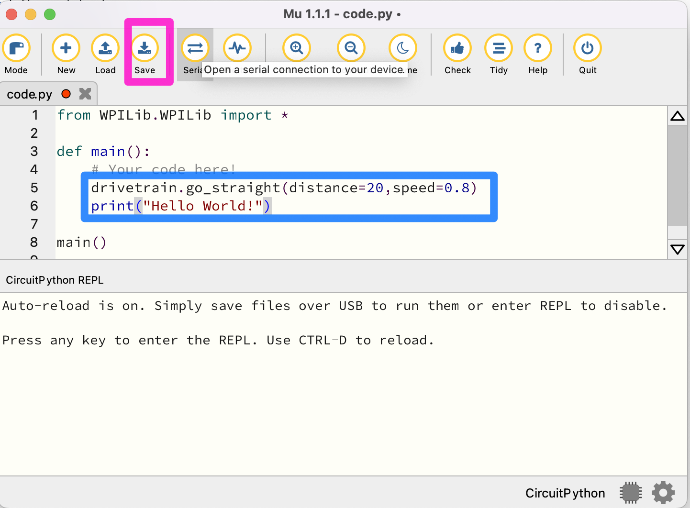

Writing your first robot program: Python
========================================

As mentioned earlier, we'll be using the XRP code
and view serial output from the robot. Be sure that your robot is plugged
into the computer and turned on, and then open up the Mu application.

Then, click the “Load” button, as shown above. Navigate to the CIRCUITPY
drive and open code.py.

code.py is the file that contains the robot code. In order to run a program,
simply edit code.py, save your changes, and your program will automatically
start executing on the robot!

Before we write any code though, there's a neat feature that will prove quite useful when testing your programs.

Click the ‘Serial’ button. If the robot is connected to the computer,
this will allow you to view your robot’s logs on your computer while
running your program, which is very useful for debugging.

Python Programming Notes:

Note 1
    This course is a hands-on learn-as-you-go course. We will not be
    teaching you how to program in Python. But if you follow the patterns
    presented to you, you should be able to fill in the blanks and accomplish
    the tasks. If you want to learn more about Python, we suggest looking
    at https://www.w3schools.com/python/default.asp Links to an external
    site. as a resource. 

Note 2
    The Mu program is designed to save the current program to your robot for execution. If you would like to save a program for future use we suggest that you copy and paste it into an editor program, such as notepad, on your computer for future reference. We also suggest saving a copy of the current program in the editor as a base for each new program or challenge you start.

Note 3
    With Python, the amount of indentation of a line of code is important. For instance, in the program below, all the indented lines are part of the main program. We suggest using the 'tab' key for indenting so that all the code is indented the same amount.

Note 4
    Any line that starts with a # character is a comment. Comments are not executed as part of the program they are notes to help you remember what you were doing in that part of the program.

Finally, let’s test some code out. Often, it's a tradition when learning a new programming language for the first program to display "Hello World!". Let's put our own twist on this tradition with our robot. Add the following code to code.py (note: the go_straight function has been renamed to straight in the final version. We'll update the screenshot soon):

Then, click the ‘Save’ button. CAUTION: As soon as you hit save, your robot will start moving. Remember, saving your changes causes the robot to initiate running the program automatically! Note that pressing Control-D will also start running your code.

You should see the robot immediately start going forward for 20 centimeters. Then, it should log “Hello World” on your computer through serial output. If nothing goes wrong, then you have successfully set up the software and are ready to write more intricate code!
