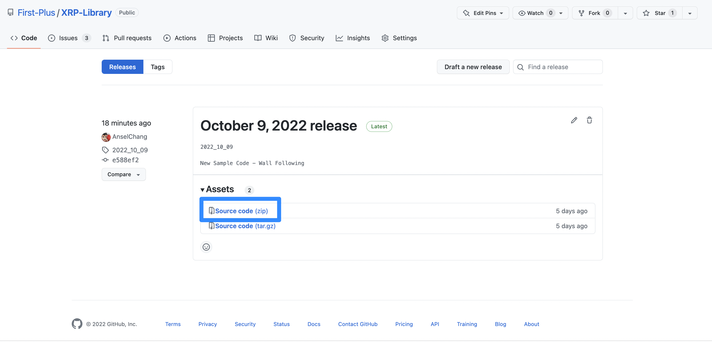
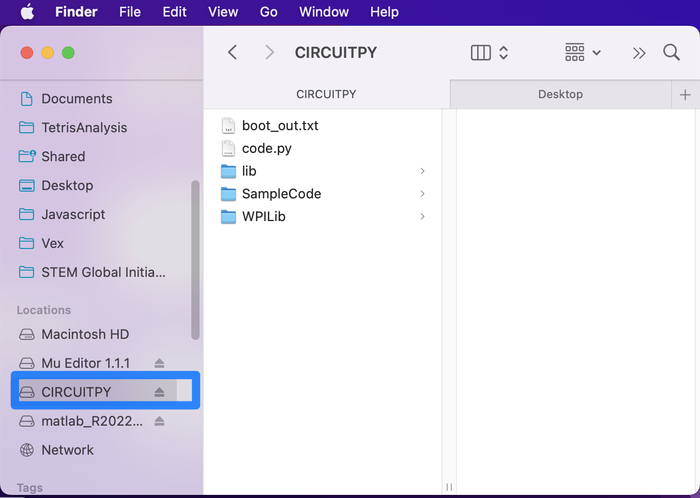

Installing the software libraries on your robot
===============================================

The software library makes it easy to write programs to control the robot and will be used throughout
the course. To install it, go to https://github.com/Open-STEM/XRP-Library/releases Links to an
external site. and download the "Source code" (zip) file.

Then, unzip the folder. To do this, open Finder on Mac, or File Explorer on Windows. Go to your
Downloads folder and find the zip file. On macs, double click the zip file to unzip it, and on
windows, right click the zip file, and click "Extract All..."

.. Note::

    Be sure that your robot is plugged into a free USB port and turned on.

Next, look for an external drive labelled ‘CIRCUITPY’. If the robot is correctly connected to
the computer and turned on, then this folder should be visible in Finder/Windows Explorer.

This is where programs can be edited and run. Delete anything that is currently in the drive.
Then, go inside the unzipped folder and copy the **contents of the folder into the CIRCUITPY
drive**. The robot should now be set up with the library!

.. Note:: 

    The CIRCUITPY drive should have the code.py file, and the lib, SampleCode, and WPILib
    folders as shown in the picture above. 

