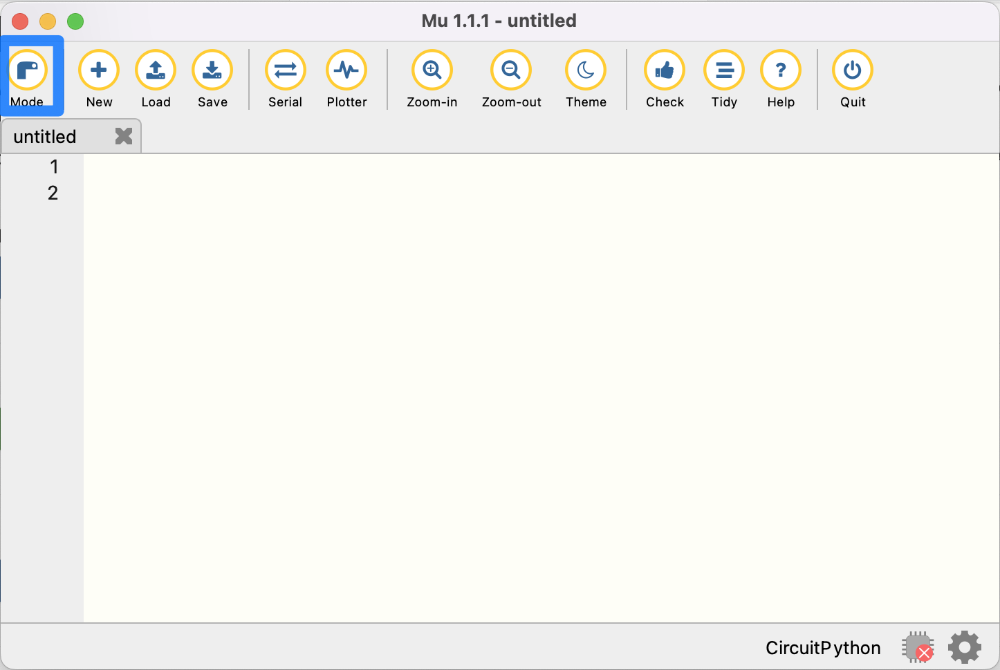
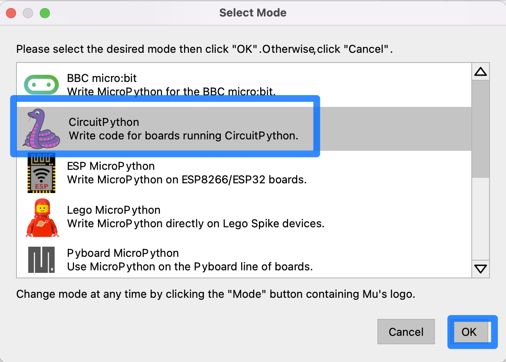
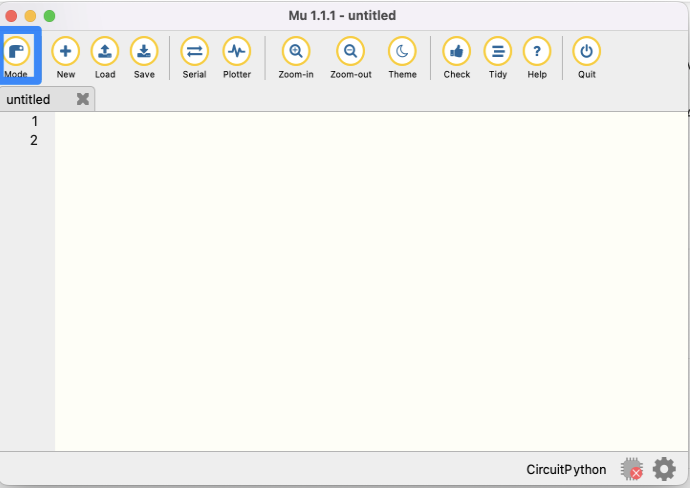
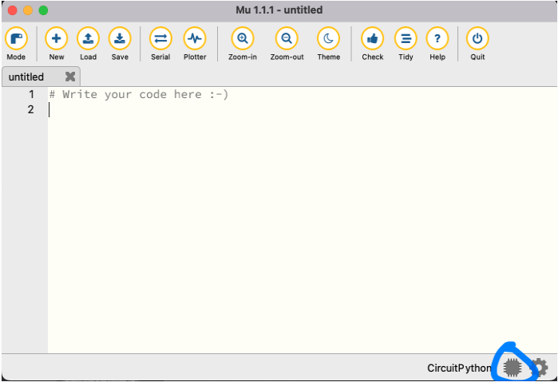

Installing the programming tools
================================

Two primary programming tools will be used in this course:

Blockly
-------

This is a drag-and-drop graphical programming system similar to Scratch. Blockly is a good choice for programming the robot, especially for learners with little to no programming experience.  Does not easily scale for larger programs and is only usable within the Blockly programming environment.

Python
------

A more widely-used language that scales well for larger programs and works with professional programming tools such as Visual Studio Code and many others. The tool that will be used throughout this course for python programming is Mu Editor, although a more professional tool such as Visual Studio Code can also be used for writing CircuitPython code that is used by the XPR Robot.

.. Note::

   A way to get students comfortable with programming more quickly is to start with Blockly getting through basic concepts such as functions, conditionals, loops, and all the basic robot operations. Then move to Python to complete the course, especially for some more complex challenges, such as the final project. This will allow for quick onboarding without having to learn too many new concepts at the same time. But the decision will depend on the lever and experience of the students taking the course.

Installing Mu Editor
~~~~~~~~~~~~~~~~~~~~

Mu is a simple and concise editor that allows us to edit our CircuitPython code, and view serial output from our robot. To install, go to the following webpage: https://codewith.mu/en/download 

.. image:: media/MU_1.png
  :width: 400
  :alt: Alternative text

Download the file corresponding to your operating system, and then open the downloaded file and follow the installation prompts that are provided.

Mu allows you to run different implementations of Python for different microcontrollers. In our case, we want to run CircuitPython, which is compatible with our Maker Pi RP2040. Select the “Mode” button shown below.

Select CircuitPython and confirm by clicking ‘OK’.

In the Mu Editor, you may notice a symbol of a red ‘x’ on a microchip in the bottom right corner of the window.

This indicates that Mu has not detected a robot device attached to the computer. In order to write and download programs to the robot, you’ll need to connect your computer to the robot via a Micro-USB cable. **Connect the robot and turn it on using the switch near the back of the robot chassis.**

.. note::

   Some micro USB cables are only designed to carry power. The one provided in your kit will carry the power and data which is required for programming your robot.

At the bottom right corner of the screen, the red "chip" icon will now be grey, indicating a successful connection between the robot and the computer running Mu Editor.

At this point, you can upload and run programs to the robot written in the main window.

Additional resources about using Mu Editor for programming your robot can be found on the project website: https://codewith.mu 
