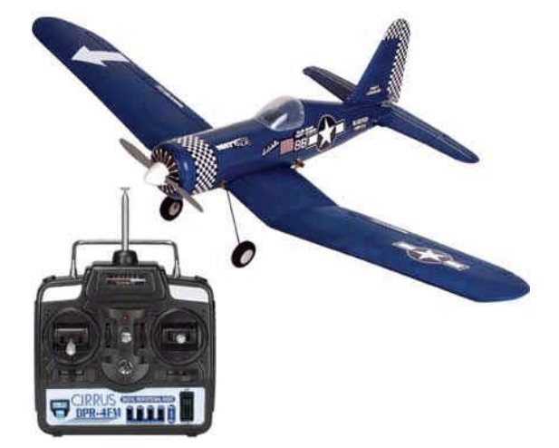
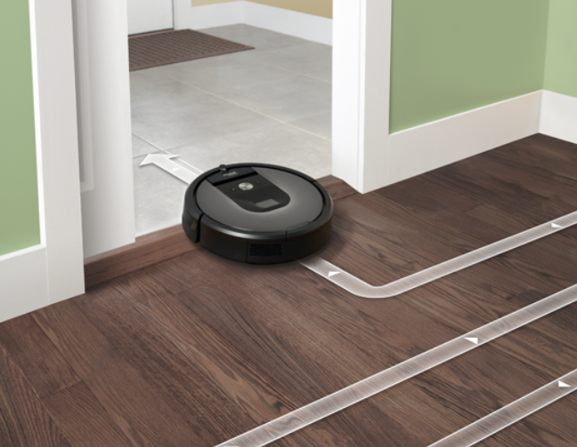
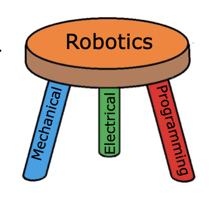

What is a robot
===============

In this course we talk about robots as devices that can:

* Sense their environment
* Think and perceive what is happening around the robot
* Carry out actions using actuators (motors)

There are many ways to define a robot, and this is only one of them. Still, it is a good idea to have a definition of precisely what a robot is. Let's look at different devices and try to decide whether each of these are robots according to our definitions.

Examples
--------

Radio Controlled Airplane
~~~~~~~~~~~~~~~~~~~~~~~~~

A radio-controlled airplane is operated by a person who holds a controller and uses the joysticks to control the airplane's flight path. It requires a remote pilot.

Actuators:

* propeller motor
* three control surface motors

Sensors: None

Summary: No sensors, no thinking, and it has to be completely controlled by a human.

Not a robot.

Drone
~~~~~

.. image:: media/drone.png
  :width: 200
  :alt: Alternative text

A quadrotor drone is capable of being teleoperated or using autonomous flight. The drone can fly a programmed course, avoid obstacles, return to the landing point, and automatically land.

Actuators:

* 4 propeller motors
* camera aiming motor

Sensors: 

* GPS (Global Positioning System) receiver
* gyros and accelerometers
* heading sensor
* altitude sensor
* rangefinder

The drone senses the environment based on its sensed location and surroundings, and flies on its own from one place to another.

This is a robot.

Vacuum cleaner
~~~~~~~~~~~~~~

A conventional vacuum cleaner is pushed by an operator around the area to clean the floor. 
Actuators: Motor to turn the fan that sucks up dirt.

Sensors:

* Fan speed sensor to ensure consistent performance.

The motor does have a sensor that keeps the motor running at a predetermined speed, but it does not sense the environment or have perception. The operator must supply all the "smarts". 

Not a robot.

 
Autonomous vacuum cleaner
~~~~~~~~~~~~~~~~~~~~~~~~~

An autonomous vacuum cleaner can — on its own — start up, vacuum one or more rooms, come back to clean its home base, then continue vacuuming until the whole job is done. It maps out each room in the house for more consistent operation.

Actuators:

* Drive motor for the wheels to get around.
* Motor for the vacuum for cleaning.
* Motor in the base (not shown) that will suck the dirt out of the vacuum cleaner so it can continue cleaning.
 
Sensors:

* Camera for visualizing the room.
* Switches on the bumper to allow it to turn around after hitting obstacles.
* Rangefinders on the side to measure distance from walls.
* Sensor to detect carpet vs floor to change the motor speed.

An autonomous vacuum is fairly smart. It can learn the map of a house after a few runs and efficiently clean rooms. It can avoid obstacles, clean rooms, stop to recharge, and continue where it left off. 

This is a robot.

Self-driving car
~~~~~~~~~~~~~~~~

.. image:: media/tesla.png
  :width: 200
  :alt: Alternative text

A self-driving car can be driven conventionally by a human or driven autonomously on city streets and highways on its own.

Actuators:

* Wheels for driving.
* Motors for controlling turning.
* Actuators to allow the robot to break on its own.

Sensors: 

* 8 cameras both outside and inside the car to view the environment and driver's attentiveness
* Rangefinders all around the car to measure the distance to adjacent vehicles
* GPS to determine car's location, and more.

The car is smart and represents state of the art robotics. It can sense the environment, understand where it will be over time, and drive to its destination while safely avoiding obstacles. 

This is a robot.

What are the parts of robotics?
-------------------------------

Robotics engineering is usually thought of as a combination of three disciplines. They are:

* Mechanical engineering - the design and analysis of mechanisms and other mechanical systems.
* Electrical engineering - the design of electronic circuits, especially all the sensors.
* Computer science - the development of advanced software (computer programs) to interpret at all the sensor data, understand it, and drive the actuators.

Robotics can be thought of as the synergy of these three fields. Designing robots requires a "systems" approach to design. Having knowledge of all three subjects allows one to develop more complex and capable systems than one with only a unitary background.

Robotics is a 3-legged stool. Without any one of these subjects, it falls down.
