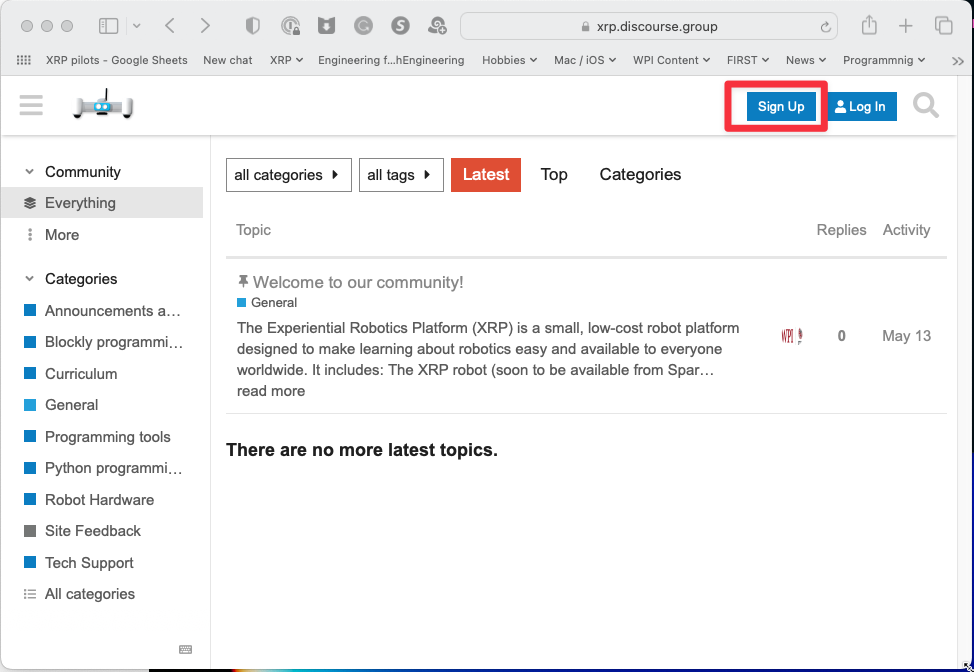

Getting Help
=================
Alongside this ReadTheDocs course, you will be using several online 
resources for getting your questions answered. The support 
tools for any technical Q&A will be monitored by the development 
team and a growing community of users like you. We are using 
Discourse for online support during this course.

Discourse
---------
The XRP Discourse server provides an easy 
way to communicate your questions, concerns, ideas, and 
conversations across the world (within this robotics program). 
Here you will find a place to posts questions and get answers to issues
that you might be having. The staff at WPI will do our best to provide
timely answers to your questions, or you might find other more experienced
community members jumping in and answering your questions.
You will find important resources, links, event 
information, and office hours here.

Please follow these steps to join the Discourse server:

#. You will want to create your account, go to https://xrp.discourse.group

#. You can browse through all the resources on the Discourse server, if you want to post
   questions and participate, you need to sign up for an account. To do that, click on the
   Sign Up button in the top right corner of the window and enter your account information.

#. And you are done! You can now ask any questions you have about the course here or just
   chat with the other members of the course. We hope you will find this course fun and interesting!

If you want Discourse on your phone, for Android or iPhone 
there is a Discourse app in the App Store that you can
download. When signing up remember to use xrp.discourse.group
for the site's address when asked.

GitHub issues
-------------

Another way to contact us, particularly about issues or bugs with any of the software is
to create issues in the GitHub repository where the software is developed.

To create a GitHub issue for the course that you are reading now, navigate to the `Issues page in the course
GitHub repository <https://github.com/Open-STEM/IntroToRoboticsV2/issues>`_

To create a GitHub issue for the XRP software libraries, navigate to our  
`GitHub repository's issue page <https://github.com/Open-STEM/XRP_MicroPython/issues>`_
and select "New issue". 

Describe your problem in detail and click "Submit new issue" to post your issue in the repository. 
A member of the XRP team will reach out if we have further questions.
