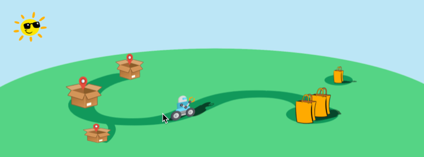

Welcome to Introduction to Robotics
===================================
Welcome to the WPI Global STEM Education Initiative Introduction to Robotics 
course using the new XRP Robots. This course teaches the basics of robotics and programming
using two programming languages: Blockly and Python. For new programmers, we recommend
that you start with Blockly 
and switch to Python once you gain more familiarity with programming the robots.  

The course has several modules you will work through, starting with an introduction 
to robotics and later covering driving, sensors, the manipulator (robot arm) and more. 
The course ends with a challenging final project that 
brings together everything you have learned in all the previous modules.

    Final project delivery robot challenge (see final project module for more information)

This is a brand-new course with new robots and software, so there may be bugs 
and unexpected problems. We will strive to be responsive to any questions you 
might have. If you have any questions or find anything not working as you 
expect it to, feel free to contact us.

For questions and technical support for the XRP, see our Discourse server.
There are instructions on how to sign up in the `Joining Platforms`
section of this course.

