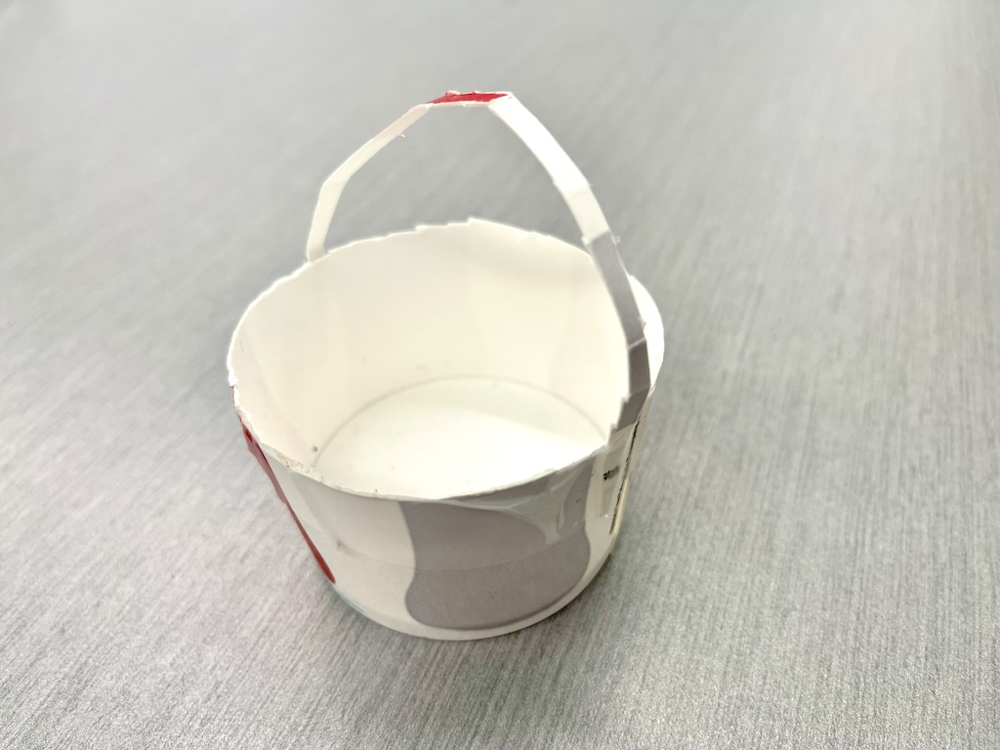

Delivery Challenge: Module Overview 
===================================

.. image:: deliveryRobotImage.png

The delivery robot has to bring packages from one location to another.
Introduction
To help people in need in the current pandemic, you and your colleagues have decided to build
an autonomous delivery robot.

Your robot will pick up food and other supplies and deliver them to residences with minimal
contact, all to help fight the spread of the coronavirus.

Of course, a full-sized version will have to wait until you get millions of dollars
in investments for your robotics company, but that doesn’t mean you can’t have fun
dreaming with a scale model here.

Your robot will have an arm for lifting and carrying “bags” of goods and sensors to help
it navigate a simple network of “streets.” Complicating things a little, not everything
to be delivered is always put in the right spot for easy collection and sometimes road
construction might block your path. But you’ll still need to make it work!

The world is counting on you! Can you make it happen?

Objectives
----------

The final project is a chance for you and your teammates to demonstrate that you can
apply concepts and strategies from the course to a specific challenge. You will apply
theoretical knowledge to the design of your system and use focused testing to improve
the performance. The project will culminate in a demonstration where you will prove your
robot’s performance. To help us understand more about your system and your process, you
will also produce a report describing the system development and an assessment of how
well it met your goals.

The successful team will design, build, and demonstrate a robot that can accomplish
a prescribed set of tasks. To be successful, you will need to:

Identify key performance criteria and develop a strategy for meeting your team’s objectives,
Identify key factors that affect performance and use analysis and testing to specify them,
Develop and apply a testing strategy to ensure performance,
Evaluate the system performance, and
Describe the system and your design process.

Challenge
---------

Your challenge is to program your robot to pick up bags of supplies from known and unknown
locations and deliver them to specified delivery points. The challenge is constructed such
that the tasks have a range of difficulty. For example, located the free range bag and
scoring them will earn more points, as will being able to navigate around the construction
sign. Since you will have to perform multiple runs, reliability will be essential.

Course
------

The course will consist of a strip of tape (to simulate roads) with a designated place to
pick up bags and three specified drop zones. Most bags will be placed at the end of the
main road, though some will be placed in a “free range” zone. Figure 1 shows a typical
arena, though we realize that there will be some variation in each course.

.. image:: deliveryRobotMap.png

Figure 1: Diagram of the arena. Individual arenas will vary.

Bags
----
You will be expected to build your own delivery bags, for example from paper or card
stock and paper clips. You should have at least two bags ready for the demo. You
may “recycle” them as the demo progresses. Here is an example of an easy to make bag
that can be constructed from a drink disposable cup you might find in a restaurant. 

Figure 2: Example of a bag for the delivery challenge

Collection
----------

Most of the bags will be placed on the line at the end of the main road. You may place
a piece of tape near the pickup zone to indicate where it starts, but the bags will be
placed at different distances from the tape.

To earn points for collecting the free-range bag, you must demonstrate that its position
can be arbitrary within the free-range zone (with the exception that you may face the
bail in whatever position you deem most favorable).

Delivery zones
--------------

Each delivery zone or platform may be no larger than 10 cm in any horizontal dimension.
The platforms for the delivery zones will be marked on the ground. You can make them
out of cardboard or any other material. To score points, each container must be placed in
a delivery zone and left there (upright) long enough to prove that it is stable.

Operation
---------

You will start with your robot on the main road and a bag in the pickup zone. On
command (a press of either button on the robot), your robot will drive to the pickup
zone, pick up a bag, and deliver it to the specified address, which will be determined
by the button press (e.g., ’GP20’ indicates a delivery to address A, etc.). Your robot
will then return to the starting point, stop, and wait for the next command.

After each delivery, you will place another bag in the pickup zone and repeat the
process, pressing the button to indicate another delivery. You may recycle the
bags as much as you wish.

At two random points in the demo, your instructor will place a road construction
sign on the main road for 30 seconds, and you will not receive credit for any delivery
during which your vehicle hits the sign.

The challenge will last 5 minutes. You may use any of the sensors that you’ve explored
in this class to accomplish the challenge. Line following will be an important behavior,
but collecting the free-range bags autonomously will require some creativity on your part.

[Video of a sample run coming soon!]

Scoring
-------

[Tune point values over time]

In your run, your team should deliver as much weight as possible, plus and including the
“free range” bags. Points will be allocated as follows:

You will receive 5 point for every package you deliver to addresses A or C. However, you
may only get 50 points max (corresponding to 10 packages) for each delivery address;
i.e., you must deliver to all three addresses to receive the maximum points.
You will receive 5 additional points for each free-range bag (20 points max) scored
at address B.
Your total score will be multiplied by the number of unique addresses you delivered
bags to. That is to say, if you scored 1 bag to Address A, and 1 bag to Address B, your
final score would be 2 * (5+5) = 20 points. If you scored a free range bag on top of that,
your score would be 3 * (5+5+5) = 45 points
No points will be received for a delivery where the robot hits the road construction sign.
You will lose 2 points for each time you have to touch your robot (e.g., to put it back
on the line), other than to specify the delivery zone at the start of each delivery. 

Covered Standards (NGSS and CSTA):
-----------------------------------

**HS-ETS1-2** Break a complex real-world problem into smaller, more manageable problems that each can be solved using scientific and engineering principles.

**HS-ETS1-3** Evaluate a solution to a complex real-world problem based on prioritized criteria and tradeoffs that account for a range of constraints, including cost, safety, reliability, aesthetics, and maintenance, as well as social, cultural, and environmental impacts.

**3A-AP-16** Design and iteratively develop computational artifacts for practical intent, personal expression, or to address a societal issue by using events to initiate instructions.

**3A-AP-17** Decompose problems into smaller components through systematic analysis, using constructs such as procedures, modules, and/or objects.

**3B-CS-02** Illustrate ways computing systems implement logic, input, and output through hardware components.

**3B-AP-10** Use and adapt classic algorithms to solve computational problems.

**3B-AP-11** Evaluate algorithms in terms of their efficiency, correctness, and clarity.

**3B-AP-15** Analyze a large-scale computational problem and identify generalizable patterns that can be applied to a solution.

**3B-AP-16** Demonstrate code reuse by creating programming solutions using libraries and APIs. 

