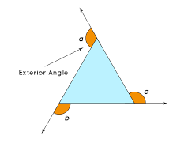
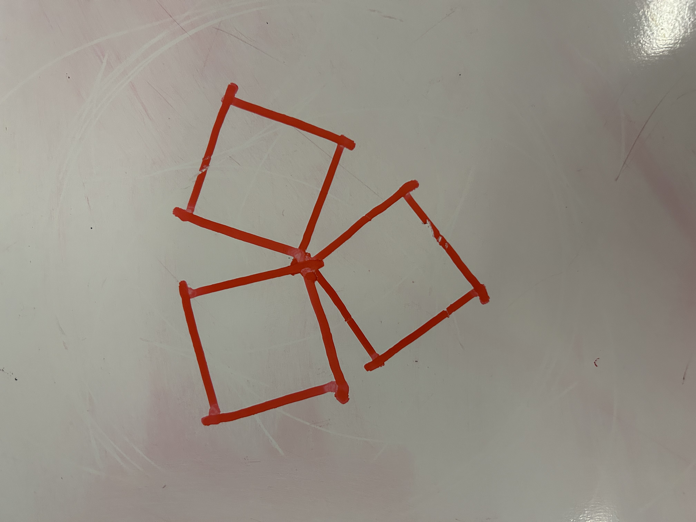

Driving With Geometry
=====================

The XRP's driving and turning functions can also be used to draw geometric patterns!
By driving a set distance and turning by a certain angle several times, you can draw a 
shape with as many sides as you want.

.. tip:: 

    To see the path your XRP has driven, you can place a dry-erase marker between the
    robot's wheels and trace your pattern on a whiteboard.

To draw any polygon, you just need to know the size of the shape's exterior angles,
and you need to decide how long the sides should be. Then, you just have to drive straight with the distance
of a side length and turn the number of degrees of the corresponding exterior angle.
Repeat this until the shape is finished.

Triangle
--------

For a triangle, the interior angles measure 60 degrees and the exterior angles measure 120 degrees.
We can trace a triangle with side lengths of 30 cm by having our robot drive straight for 30 cm
three times and turn 120 degrees in between each drive straight.

.. tab-set::

    .. tab-item:: Python

        .. code-block:: python

            from XRPLib.defaults import *

            differentialDrive.straight(30, 0.5)
            differentialDrive.turn(120, 0.5)
            differentialDrive.straight(30, 0.5)
            differentialDrive.turn(120, 0.5)
            differentialDrive.straight(30, 0.5)

    .. tab-item:: Blockly

        .. image:: media/triangle-blockly.png
            :width: 300

Square
------

The process for tracing a square is similar to tracing a triangle. The interior angles are 90 degrees so
the exterior angles are also 90 degrees. Keeping a side length of 30 cm, we can trace a square by 
programming our robot to drive straight for 30 cm four times and turn 90 degrees between each drive straight.

.. tab-set::

    .. tab-item:: Python

        .. code-block:: python

            from XRPLib.defaults import *

            drivetrain.straight(30, 0.5)
            drivetrain.turn(90, 0.5)
            drivetrain.straight(30, 0.5)
            drivetrain.turn(90, 0.5)
            drivetrain.straight(30, 0.5)
            drivetrain.turn(90, 0.5)
            drivetrain.straight(30, 0.5)

    .. tab-item:: Blockly

        .. image:: media/square-blockly.png
            :width: 300

Polygons
--------

We can generalize the procedure used to make a triangle and square to make any regular polygon; you just have to
determine the exterior angle and choose a side length. However, for polygons with many sides, this process can get very tedious. 
Instead of repeating the same code multiple times, we can use a function to simplify the process. 

First, lets determine what information the function needs. To trace a polygon, you need to determine the number of sides 
and the length of each side. We can create a function that takes these two values as an input. 
The function will drive the distance we give it, turn by the exterior angle, and then repeat that process
as many times as there are sides in the shape. We can use a loop for this. The one problem is:
how do we know the measure of the exterior angles? Fortunately, this can be easily calculated with this equation:

.. math:: 
    360/n

With the variable *n* representing the number of sides of your polygon, this equation 
determines the number of degrees of your polgyon's exterior angles. With this information, you 
can now write a function to trace any regular polygon!

.. tab-set::
    
    .. tab-item:: Python

        .. code-block:: python
        
            from XRPLib.defaults import *

            def polygon(sideLength, numSides):
                for i in range(int(numSides)):
                    differentialDrive.turn((360 / numSides), 0.5)
                    differentialDrive.straight(sideLength, 0.5)

    .. tab-item:: Blockly

        .. image:: media/polygon-blockly.png
            :width: 450

Pinwheel
--------

Now we know how to easily draw any polygon, but we can take it one step further and draw a polygon pinwheel.
This pattern consists of several polygons extending out from a center point. Your XRP can execute this
by tracing several polygons consecutively and turning slightly between each new polygon. A pinwheel of 3 squares should look 
something like this:

Programming this may seem like a daunting task, but it is actually quite simple. Every time you want to trace a piece
of the pinwheel, you just need to call your polygon function from before and then turn your robot slightly. We can calculate the measure of this
turn by dividing 360 degrees by the number of polygons we are tracing in order to keep even spacing between each polygon.
Repeat this process as many times as there are polygons in the pinwheel, and your pattern will be finished!

.. tab-set::

    .. tab-item:: Python

        .. code-block:: python

            from XRPLib.defaults import *

            def pinwheel(sideLength, numSides, numShapes):
                for i in range(numShapes):
                    polygon(sideLength, numSides)
                    drivetrain.turn(360 / numShapes, 0.5)

    .. tab-item:: Blockly

        .. image:: media/pinwheel-blockly.png 
            :width: 450
