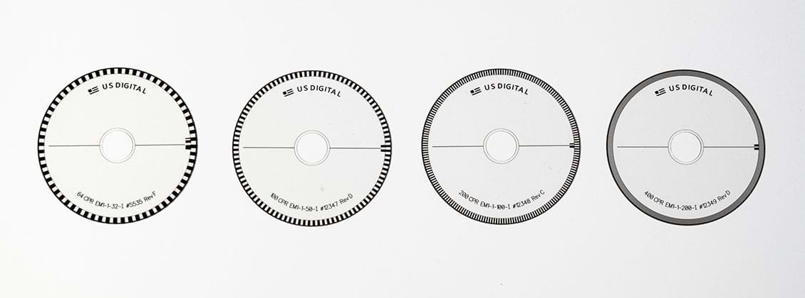
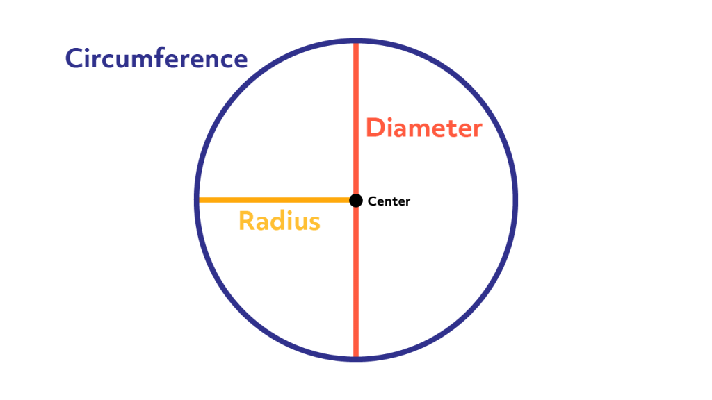
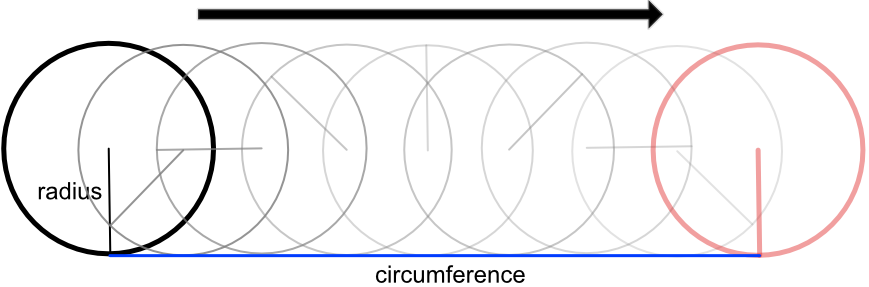

The Encoders
============

In the last lesson we mentioned *encoders*. What are they and what do they do?

Encoders are sensors which measure how far each motor (and thus each wheel) has
rotated. We mentioned that our motors aren't perfect, so when we tell them to go
a certain effort we don't know how fast it is actually rotating. Encoders 
measure exactly what the motor is doing and report this information back to the 
XRP.

An encoder uses a disk like the one above with alternating clear and black 
squares. The disk is attached to the output shaft of the motor. A small light 
is shined through the edge of the disk, and a sensor on the other side sees the
light. When a black part of the disk is in front of the light, the sensor sees
nothing. When a clear part of the disk is in front of the light, the sensor can
see the light. As the disk rotates, the sensor constantly switches from seeing 
and not seeing the light. The XRP can automatically count how many times it has
switched between seeing and not seeing the light, and can use this to calculate 
how far the wheel has moved.

The size of the black and clear squares determines how *precise* the encoder is.
As the squares get smaller, the light switches more times for the same amount of
rotations of the wheel, and thus we can more precisely measure the distance. The
downside of having really tiny squares is that the XRP's processor needs to work
harder to keep up with counting all the switches. In the image above you can see
some disks with different levels of precision.

.. tip:: 

    The disk and sensor in the XRP is hidden inside the motor's plastic case, so
    you won't be able to see them.

The XRP handles doing all the math to convert these switches into a real 
distance measurement for you, so you don't have to worry about it. We can use 
some new :code:`drivetrain` functions to see what the encoders are measuring:

.. tab-set:: 

    .. tab-item:: Python

        .. code-block:: python

            from XRPLib.defaults import *
            from time import sleep

            while True:
                print(drivetrain.get_left_encoder_position())
                sleep(1)

    .. tab-item:: Blockly

        .. image:: media/encoder.png
            :width: 300

This code uses something new: a :code:`while` *loop*. A :code:`while` loop will
run the code underneath it until a *condition* is no longer equal to
:code:`True`. In this case, the *condition* is the keyword :code:`True`, which
means that this code will run until :code:`True` doesn't equal :code:`True`.
Since this will never happen, the code will run forever unless you stop it 
manually on your computer.

.. tip:: 

    You will learn more about loops and conditions later in the course.

The code should run forever, display the drivetrain's left encoder position, and
then wait for one second. Then, it repeats and does this forever. If we didn't 
wait for one second, the XRP would read and send the encoder position to your 
computer as fast as it could (very fast!) which would be too much data for your 
computer to display at once on the screen.

.. admonition:: Try it out

    Try running this code to see what happens. Spin the left wheel of the XRP
    by hand and notice how the number changes.

Calculating distance
--------------------

Let's learn a bit about how the XRP uses the encoder to calculate how far the 
robot has moved.

The XRP knows the diameter of the robot's wheels; every XRP has the same wheels!

If a car's wheel rolls on the ground one full revolution, how far does the car
move? The car moves by one *circumference* of the circle:

.. tip:: 

    Reminder that the circumference of a circle is the distance around it.

    The circumference is calculated as :math:`C = \pi \cdot d`, where :math:`d`
    is the *diameter* of the circle.

If a car wheel (which is a circle with a circumference of 100 inches) rotates 5
times, how far does the car go? How would you find that?

 
You would rotate the wheel once, and find that it has traveled 100 inches,
because the wheel would trace out it's circumference on the ground. Then, you
would rotate it a second time, and see it move another 100 inches. Then a third,
a fourth and a fifth time, and see the wheel has traced out it's circumference
on the ground 5 times. 

The amount it has traveled is 5 times the circumference. This can be used for
any number of rotations. If you rotate the wheel 3 times, you would move forward
3 times the circumference (300 inches), if you rotated it 1 and a half times,
you would move forward one and a half times the circumference (150 inches). 

.. math:: 
    
    d\text{ cm} = (\text{number of rotations}) \cdot (\text{circumference})

The XRP uses this equation to automatically calculate how far the wheels have 
moved in centimeters using the encoders.

Driving a distance (again)
--------------------------

In the last lesson you used a constant speed and a time to drive a distance. 
Now that you know that the encoders actually measure the distance, it would be 
better to use them for your :code:`drive_distance` function. We can modify your 
function to use a :code:`While` loop:

.. tab-set:: 

    .. tab-item:: Python

        .. code-block:: python

            def drive_distance(distance_to_drive):
                while drivetrain.get_left_encoder_position() < distance_to_drive:
                    drivetrain.set_speed(5, 5)
                    time.sleep(0.01)
                drivetrain.stop()

    .. tab-item:: Blockly

        .. image:: media/drivedistanceencoder.png
            :width: 300
    

This code block uses a loop to constantly check if the left encoder position is
less than the distance you want the robot to go. Once it is no longer less than 
this distance, the loop stops running and the code moves on to the next line.
In this case, the next line tells the robot to stop.

.. admonition:: Try it out

    Replace your :code:`drive_distance` function with this new one. Try it out
    next to a meter stick. Is it more or less accurate than before?

.. admonition:: Challenge

    This code only checks the left encoder. Since both wheels are moving the
    same speed, this *should* be fine, but as we said, the motors aren't
    perfect. Can you think of a way to combine both encoder values together?

    To read the right encoder, you use
    :code:`drivetrain.get_right_encoder_position()`

Turning to a heading
---------------------

Once you know how to drive a certain distance with the XRP, it is easy to turn to a certain heading with it. 
First, you need to calculate the distance that a wheel must travel so that you are facing the correct heading,
and then simply rotate the XRP until the encoders have traveled that distance.

Calculating the necessary distance is complicated, but we can break down this problem into steps.

first, lets make a fraction that represents from 0.0 to 1.0 how far around the robot's circumference 
the wheels need to travel. In this case 0.0 is 0 degrees and 1.0 is 360 degrees. 

Now to get the distance the wheel travels, we need to multiply this fraction by the total distance the wheel
travels to rotate 360 degrees, this number is the circumference of a circle with the diameter same diameter 
as the robot. We can calculare this by multiplying the wheel track distance by pi. 

finally, to get the number of wheel rotations, we need to divide this distance by the circumference of 
the wheel, or pi times the wheel diameter. We can cancel pi from both sides of this division and that
leaves us with.  

.. math:: 

    \frac{\text{target degrees} \cdot \text{robot wheel track}} {360 \cdot \text{wheel diameter}}

Now that we have the number of wheel rotations, the rest of the program is easy. just turn the robot in the direction of the turn, and stop once
the number of rotations has exceeded the calculated rotation goal.

.. tab-set::

    .. tab-item:: Python

        .. code-block:: python

            def turn(target):
                global rotations
                differentialDrive.reset_encoder_position()
                rotations = (target * 15.5) / (360 * 6)
                if target > 0:
                    differentialDrive.set_effort((-0.3), 0.3)
                else:
                    differentialDrive.set_effort(0.3, (-0.3))
                while not math.fabs(motor1.get_position()) >= math.fabs(rotations):
                
                differentialDrive.stop()

    .. tab-item:: Blockly

        .. image:: media/encoder-turn-blockly.png
            :width: 300
