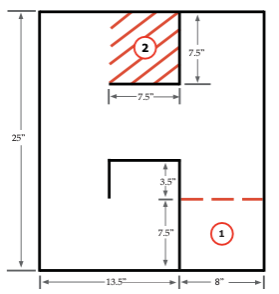

Parking Challenge
=================

Challenge Description
---------------------
This challenge features a sequence of turns that the robot must perform in order
to get to the “end” of the Labyrinth. The robot must first begin at the starting
point, and get to the goal area by completing turning and forward movement behaviors. 

Materials needed
----------------
* White board or six 8.5”x11” sheets of paper (use scotch tape to tape the six sheets of paper together to form a 25.5”x22” rectangle. Turn it over and tape outside border to floor with blue masking tape.
* Black electrical tape (you can substitute blue masking tape for this exercise)
* Red electrical tape or red marker 
* Scissors (or cutting tool)
* Ruler (or straightedge)

Project specifications
----------------------

    
    Carnegie Mellon Robotics Academy, Labyrinth Challenge 

The robot should do the following:

* Begin fully contained in position 1 and then maneuver to goal area.
* Reach and be fully contained within position 2 without crossing any black lines.
