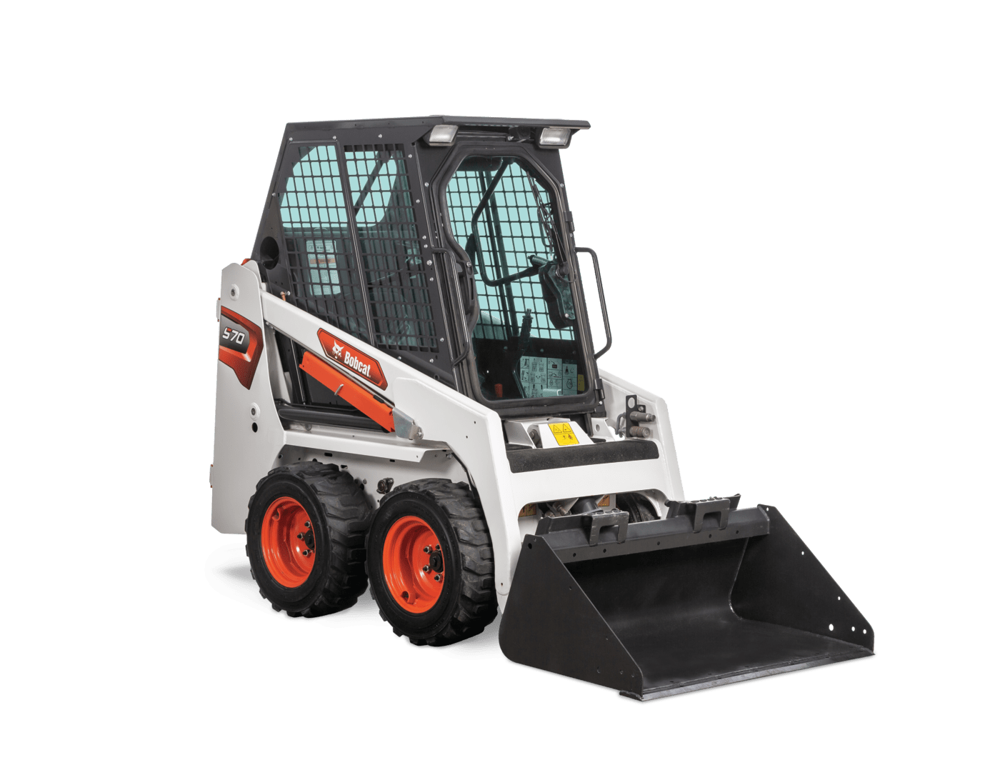
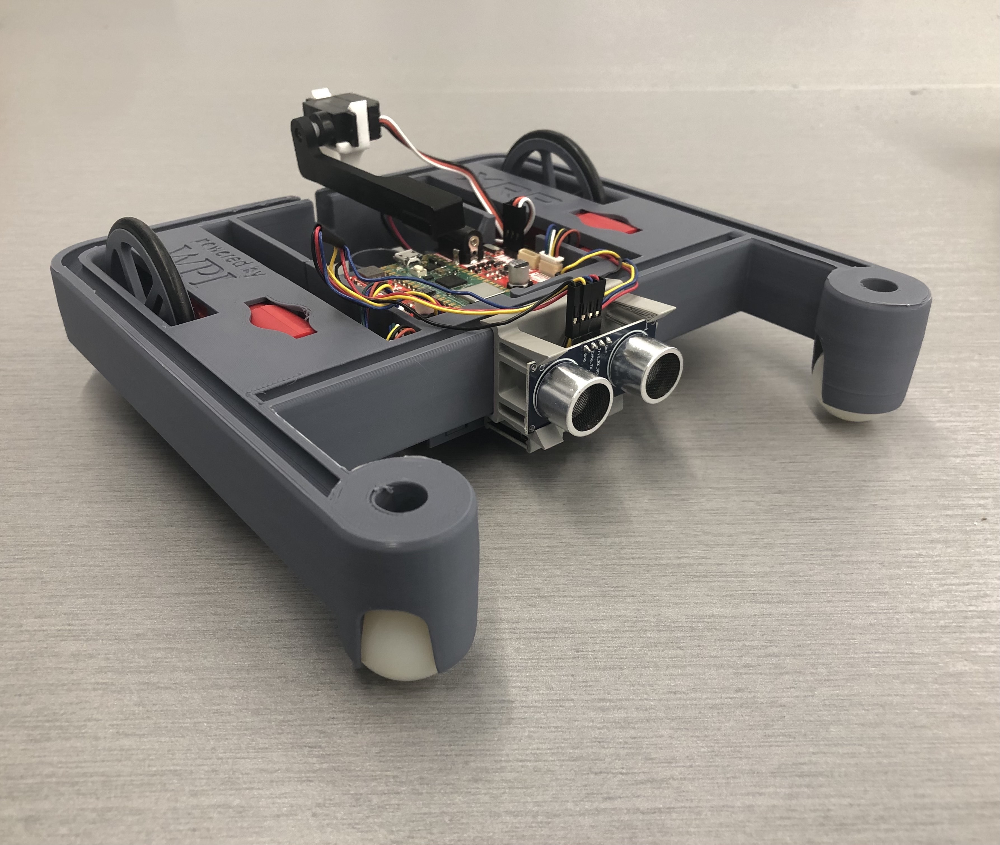
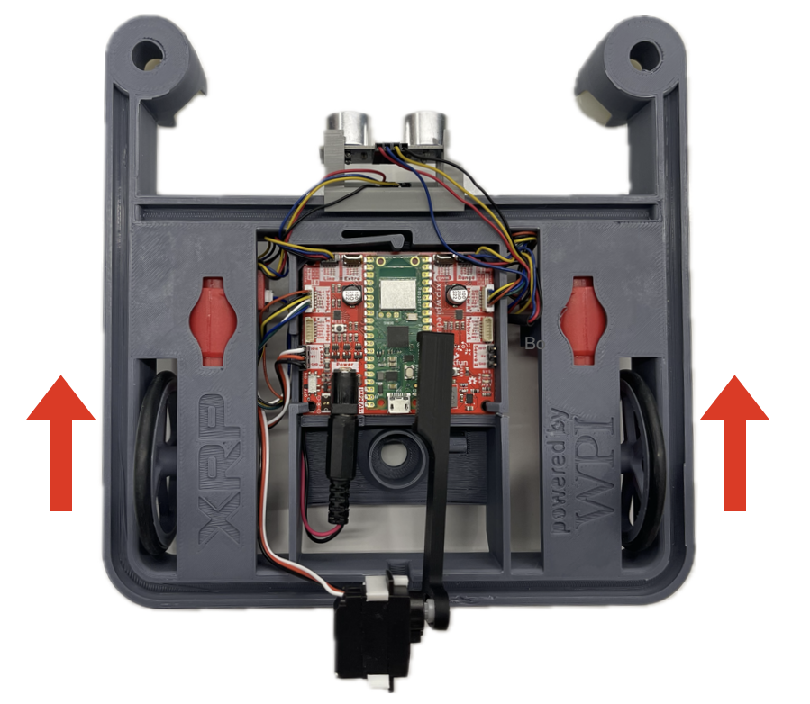
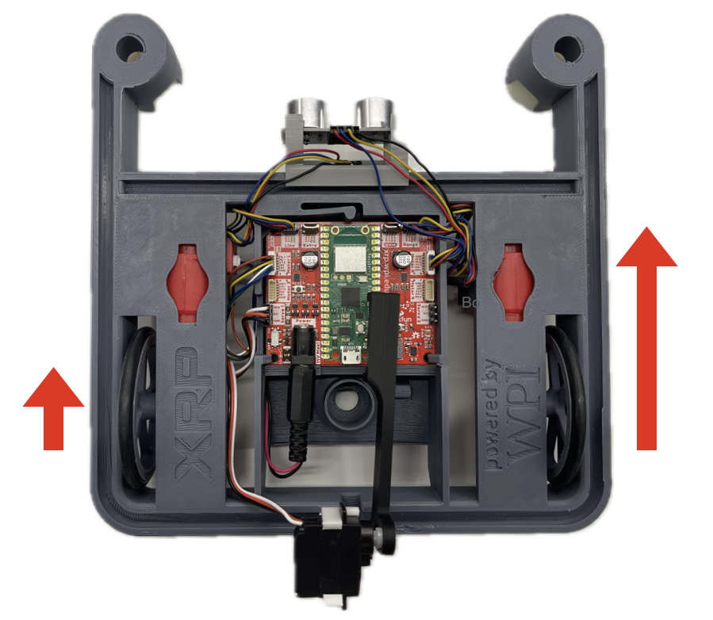
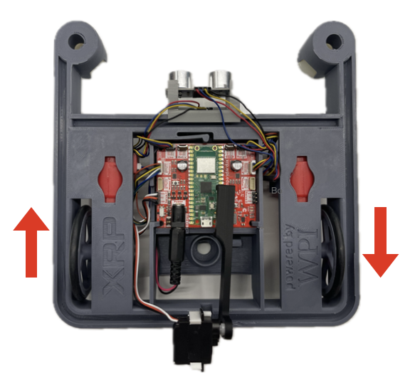
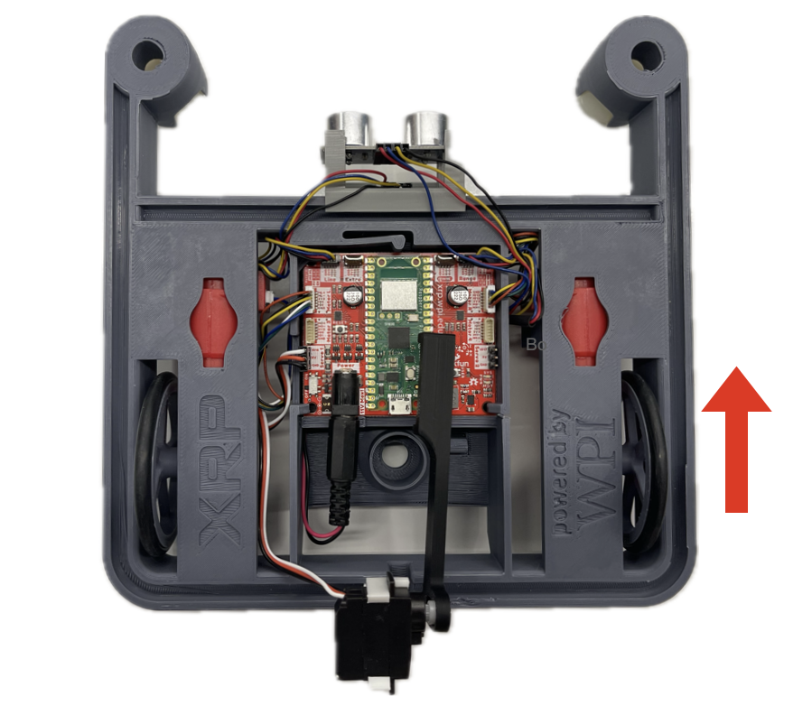

Understanding Your Robot's Drivetrain
=====================================

Introduction
------------

The main body of your XRP is called the *drivetrain*. We call it this because it
holds the two wheels which drive your robot around. Specifically, the XRP has a 
*differential drivetrain*. This is the same kind of drivetrain that you would 
see on a skid-steer loader. 

The XRP robot turns using skid-steering which means that while the robot is turning
some of the wheels, sometimes the front casters, will be skidding. This requires
more energy to complete the turns and depends on the friction of the front casters
and the particular driving surface.

Each wheel of your XRP's drivetrain has a motor attached to it. We can use code 
to tell this motor what we'd like it to do. Getting the robot to move in a desired
path is done by setting the speeds of the two drive motors. There are a lot of
variations in how these motors can be set. Here are some basic examples:

Driving straight
----------------
The most fundamental common driving that the robot will do is traveling straight.
To do this, both wheels move forward at the same speed so that
the robot moves straight.

Turning in an arc
-----------------
Robots can turn in an arc-shaped turn, where one wheel drives faster than the other,
causing the robot to turn away from the faster wheel. As the difference in speed
between the two wheels increases, the turn tightens. If the turn continues, the robot
will drive in a complete circle. In this case, the radius of the circle decreases
as the wheel speed differences increase.

Turning in place
----------------
One advantage the XRP has over a car steering system is that it can turn in place
where the robot turns on a point roughly between the two wheels. This
allows the robot to easily get out of tight spaces without having to make a wide
arc turn. The point turn is often used for navigating the robot between two places
since it follows an easily predictable path.

Turning on one wheel
--------------------
If one wheel drives forward or backward, and the other wheel remains stopped, the
robot will turn in place, with the turning center being the stationary wheel. This
is often called a swing turn because the robot swings around the non-moving wheel.
With a swing turn, the diameter of the circle traced by the outside wheel is
double the wheel track.

Effort
------

There are several ways we can tell the motors what to do. The most basic thing 
we can control is the *effort* the motor should be applying.

Imagine you are riding a bike on a flat surface, pedalling at a normal speed. 
Now imagine you encounter a hill. If you keep pedalling at the same speed, you
won't slow down when you go up the hill. However, this is not easy! You'd need 
to pedal *harder* to go the same speed up the hill.

Now instead imagine that when you get to the hill, you keep pedalling as hard as 
you were on the flat section. You'll go up the hill slower, but you won't be as 
tired. This is what we mean by the *effort* of the motor. You're not telling the
motor how fast it should move, but rather how hard it should work. If you tell 
your robot's motors to work at a constant effort, your robot's speed will change
depending on whether it is driving on a flat surface or an inclined one.

.. youtube:: z6aIVpf3qN0

.. youtube:: Zcr83kcO_Pk

In both videos, the robot is using the same effort. In the first video, the robot is slowly moving uphill because gravity is fighting against
its effort. In the second video, the robot is moving quickly downhill because gravity is working in the
same direction as the effort. The force output from the motors is the same, but the speed will depend on
resistance to the force.

.. tip:: 

    Effort is also like the throttle in a car. If you're going up a hill, you 
    need to push the throttle more to maintain the same speed on the hill. If 
    you don't push the throttle more, you'll slow down.

First movements
---------------

.. note:: 

    Elevate your XRP on top of a box or other object so that the wheels aren't touching anything and can spin freely.

Before driving the robot around, let's write some simple code to spin one of the
wheels. This will help you get familiar with the XRP programming environment and
check that your XRP itself is working properly.

.. admonition:: Try it out

    Create a new file in the IDE called :code:`spin_wheels.py`. Add the 
    following code to it:

    .. code-block:: python

        from XRPLib.defaults import *

        left_motor.set_effort(0.5)

    Run the code and see what happens.

Let's break down the code line by line:

:code:`from XRPLib.defaults import *` tells your robot to load code from 
**XRPLib**. Don't worry too much about what all the commands in this line mean 
right now, just know that you'll put this line at the top of most of your XRP
programs.

:code:`left_motor.set_effort(0.5)` uses a *function* provided for you in **XRPLib** 
called :code:`set_effort` that is applied to the left motor. The :code:`0.5` is a *parameter* to 
this function which tells it that we'd like the motor to apply 50% effort. 
On the XRP, we write percentages as decimal numbers between 0 and 1, with 1 being 100%.

.. Explain functions in greater depth later on (pinwheel activity?)
.. A *function* is a block of code that can be used multiple times in your program
.. to make complicated tasks easier. For example, the
.. :code:`left_motor.set_effort()` function tells the left motor to apply an effort
.. you as the programmer specify.

.. :code:`left_motor.set_effort` is a function that we provide for you in
.. **XRPLib**. Later in the course you will see how you can write your own
.. functions to make it easy to make the robot do complicated sequences of actions.

.. When you want to use a function, you *call* it by writing its name in your code.
.. This causes the function's code to start running.

.. The number you put between the parenthesis is a *parameter* (sometimes also
.. called called an *argument*) of the function. These allow you to tell the
.. function how it should do its job. As the programmer, you must provide a *value*
.. for each *parameter*. If we wanted to make the robot drive forwards at full
.. speed, we would *call* the function like this:

Now that we've tested the left motor, let's test the right one! How do you think
you would modify the code to spin the right motor? Simply replace
:code:`left_motor` with :code:`right_motor`.

.. admonition:: Try it out

    Modify your code and run it on the robot. Make sure the right wheel spins.
    
    Push an object like a pencil against the wheel to add some resistance.
    Notice how the wheel slows down when you do this, since it would need more
    effort to keep going the same speed.

Going backwards
---------------

We've gotten the wheels spinning forwards, but what if we want to go backwards?
To do this, we simply have to pass in a *negative* number for the effort
parameter. This means that we can use any number between -1 and 1 for the effort
value. -1 will be full effort backwards, 1 will be full effort forwards, and 0 
will stop the motor.

.. admonition:: Try it out

    Try to write code that makes both wheels spin backwards.

This table shows some different effort values and what the wheel would do:

.. list-table::
   :header-rows: 1

   * - Speed value
     - Wheel action
   * - 1
     - Wheel spins forwards at 100% effort
   * - 0.5
     - Wheel spins forwards at 50% effort
   * - 0
     - Wheel stops spinning
   * - -0.5
     - Wheel spins backwards at 50% effort
   * - -1
     - Wheel spins backwards at 100% effort

