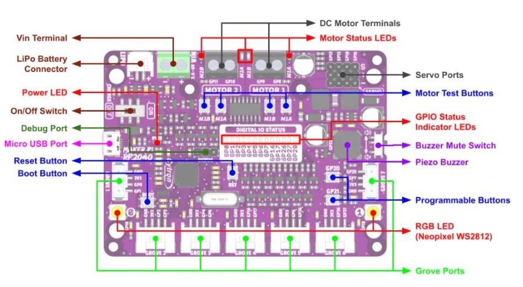

Waiting for Button Input
========================

You may have noticed that your code runs immediately after uploading it. This is nice sometimes, but sometimes you aren't coding in the same place you will be running your code, and the robot suddenly driving itself off the table isn't an ideal result. In order to have the code run on command, we can use the on board buttons to tell the code when to run.

Using Button Inputs
-------------------

There are two buttons on the board from which we can get input, labeled as GP20 and GP21 respectively. As such, there are two functions we use to check if either one is being pressed:

.. code-block::python
    buttons.is_GP20_pressed()
    buttons.is_GP21_pressed()

These methods both return a boolean value (a True or False value), which means they can both be used directly as a condition for a while loop:

Waiting for a button input
--------------------------
Since these functions return True if they are being pressed, and False if they aren't, waiting for a button press is as simple as:

.. code-block::python
    while not buttons.is_GP20_pressed():
        time.sleep(0.01)
The time.sleep statement is necessary in order to not overload the button pin. Checking the button 100 times a second is still more than enough precision for almost any application.

Waiting for a button input allows us to start our program on command, which is a very convenient feature.

Try putting this code at the start of any of the programs you have written so far. Take note of how the program begins as soon as you press the button. 

Mini-Challenge: Multiple Button Presses
---------------------------------------
But what if we instead wanted to check for multiple consecutive button presses? If you just place the previous segment of code a few times, you may see that pressing the button once may allow for all or most of the checks to pass, as you aren't telling the code to wait for you to release the button before registering the next check. 

Try writing your own implementation where you have to press either button 3 distinct times before your program begins.

Using the Sample Code's Implementation
--------------------------------------
We have provided some sample code to handle the waiting for a button code. But first you have to tell Python to import that code into your program. Use the following line at the top of your program to import that code.

.. code-block::python
    from SampleCode.sample_miscellaneous import *

This line gives everything in code.py access to everything in sample_miscellaneous.py, including wait_for_button().

It can be used very simply, by placing the call at the beginning of your def main():

.. code-block::python
    def main():
        wait_for_button()
        #
        # Your Code Here!
        #