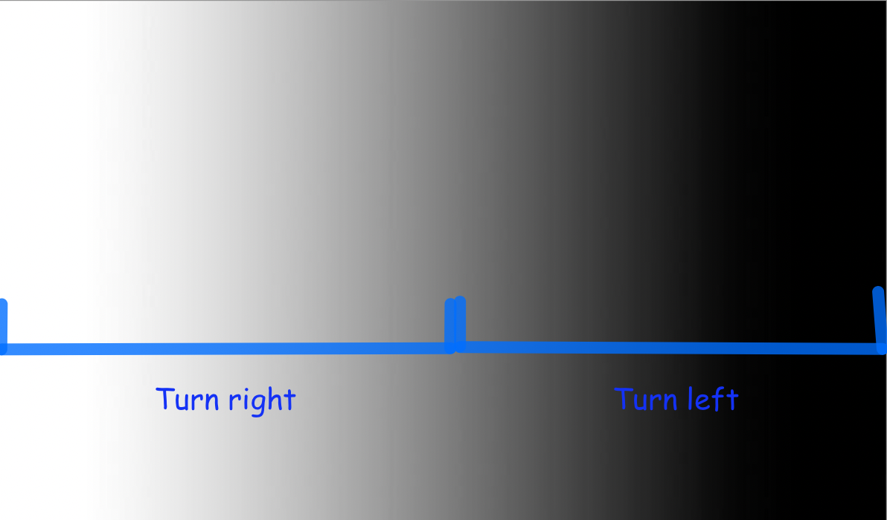

Following the Line: On/Off Control
==================================

Now, let's turn our attention towards one of the core challenges in the final
project - following a line. In the project, the robot will need to drive to
multiple different locations, but doing this just based on distance can result
in the robot not getting to exactly the right place. What if the wheels slip
while driving? What if the robot needs to drive along a more complicated path? It's
easier to follow a line than it is to exactly measure out the course the robot
needs to follow and program it.

How do we follow a line?
------------------------

Consider using just one of the reflectance sensors. As a refresher, it gives a reading
from 0 (black) to 1 (white). Assuming that the reflectance sensor is at the center of the robot, 
it will sense part of the black line when the robot is centered on the line. 
What logic would we need if we wanted to follow the center of the line?

If the reflectance sensor reads black, it means the robot is perfectly on
the line, and we'd want to go straight, setting both motors at the same speed.
But if the reflectance sensor reads grey or white, it would mean that the robot
is partially or completely off the line. We'd want to correct this by steering
it back to the center, but does it turn left or right?

Unfortunately, there's no way to tell. The robot has no way of knowing which
direction it is drifting off the line. Instead, try following an edge of the
line. If we try to follow the left edge, then there's two possible states in
which the robot reacts.

* If the sensor reads closer to white, that means we're too far to the left, so
  we need to turn slightly to the right.
* If the sensor reads closer to black, that means we're too far to the right, so
  we need to turn slightly to the left.

And that's it! We want to keep reading values from the reflectance
sensor quickly, and at each time determine whether it's closer to white (with a
value less than the threshold) or closer to black (with a value greater than 0.5), and
depending on the result, either set the motor to turn right (set left motor
speed to be faster than right) or turn left (set right motor speed to be faster
than left).

This seems like a solution involving an if-else statement. Our condition would
be related to whether the value is greater or less than 0.5.

As you may remember, an :code:`if` / :code:`else` statement allows you to run different blocks of
code based on a *condition* (the same kind of *condition* you used in a :code:`while` loop)

    Actions your robot should take based on what the sensor sees.

Above is an illustration of how we'd want the robot to act based on the reading
of the sensor.

.. admonition:: Try it out

    Write some code which uses an :code:`if` / :code:`else` statement to turn 
    the robot one direction or another based on the reflectance sensor. To do 
    this, you'll use the :code:`drivetrain.set_speed` function using different
    speeds for the left and right wheels. Remember, using a higher speed on the
    left wheel will make the robot turn right, and vice versa. You can use your 
    ``is_over_line()`` function to check if the sensor sees a line.

    You will need to experiment with different speed values for each wheel; too
    high and your robot will drive off the line before it gets a chance to
    correct for it, too low and your robot will not correct in time and will
    spin in circles. Try to get your robot to follow the line as fast as you
    can!

.. tab-set::

    .. tab-item:: Hide

        Click the other tab to see a hint.

    .. tab-item:: Hint

        Consider the following example code:

        .. tab-set::

            .. tab-item:: Python

                .. code-block:: python

                    from XRPLib.defaults import *
                    import time

                    while True:
                        if drivetrain.get_left_encoder_position() > 20:
                            print("Left encoder is greater than 20 cm")
                        else:
                            print("Left encoder is less than 20 cm")
                        time.sleep(0.1)

            .. tab-item:: Blockly

                .. image:: media/if-else.png
                    :width: 300

            
        In this example code we print different things based on the left motor's encoder position.
        You can use a similar structure to set different speeds based on the reading from the reflectance sensor.