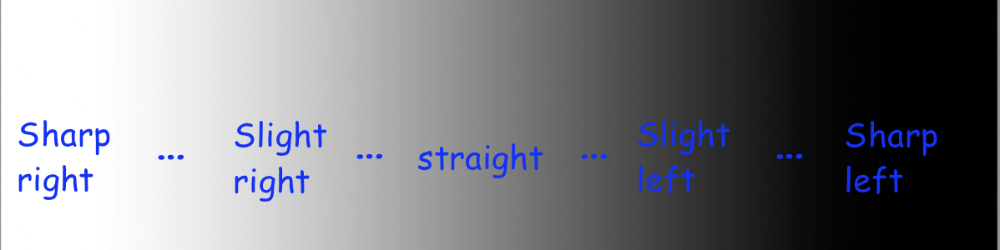

Following the Line: Proportional Control
========================================

In the measuring distances module, you used proportional control to make the
robot drive straight along a wall. We can apply proportional control to the line
following problem too!

The perks of proportional control
---------------------------------

Let's circle back to the previous exercise - following the line by either
turning left or right depending on whether the robot is situated to the left or
the right of the line.

What is immediately striking about following the line in this way? Well, the
robot must constantly oscillate in order to stay on the edge of the line,
because even the smallest deviation from the edge of the line results in the
robot wildly turning to compensate. In addition, it does not react any more
forcefully to bigger deviations like when the line starts curving, and as soon
as it loses sight of the line, it has no way of recovering.

Instead of only having two cases, it seems like we'd want a whole bunch of
cases, for anywhere from a sharp left turn to going perfectly straight to a
sharp right turn, and everything in between, based on whether the reflectance
sensor is completely on white, grey, black, or somewhere in between.

    Desired steering actions based on what the sensor sees.

Having a long chain of if-else statements doesn't sound fun. Perhaps we can look
at this with a completely fresh approach?

From the previous module, we looked at proportional control to smoothly control
the robot's distance to the wall using the distance sensor. Can we use the same
concept here?

Calculating error
-----------------

With proportional control, we have an error value we desire for it to tend to
zero, and some motor output is controlled proportional to the error to minimize
that error - in the case of maintaining a certain distance to the wall, the
error was the difference between the target and actual distance, and the output
was the speed of both drive motors. In the case of line following, the error is
the difference from 0.5 - since ideally, the robot follows the grey edge of the
line and goes straight - and the motor output is how the robot should turn.

So, we can obtain error value with the following code:

.. tab-set::

    .. tab-item:: Python

        .. code-block:: python

            error = reflectance.get_left() - 0.5

    .. tab-item:: Blockly

        .. image:: media/set_error.png
            :width: 300

Above, we subtract 0.5 to *normalize* the reflectance value: the error is
negative when the robot is too far left and needs to turn right, and positive
when the robot is too far right and needs to turn left. Let's put that code into
the test. We can put it in the loop, print out the error at each iteration, and
move the robot around the line to see how the error changes. The code is as
follows:

.. tab-set::

    .. tab-item:: Python

        .. code-block:: python

            from XRPLib.defaults import *
            from time import sleep

            while True:
                error = reflectance.get_left() - 0.5
                print("Error: ", error)
                sleep(0.1) # This sleep makes the loop run 10 times every second

    .. tab-item:: Blockly

        .. image:: media/print_error.png
            :width: 300

Implementing proportional control
---------------------------------

Based on the computed error, we want that to determine how much the robot turns. 

.. figure:: media/p_control_2.png
    :align: center

    Desired steering actions and proportional control output based on what the
    sensor sees.

This image illustrates how the error impacts how much we want to turn. Remember:
making the robot turn is simply setting the left and right motors to different
efforts. So, the solution is to set a base effort, say, 50% effort, that both
motors move at when the error is at 0. Then, have the calculated error influence
the difference in efforts between the two motors. As explained through code:

.. tab-set::

    .. tab-item:: Python

        .. code-block:: python

            drivetrain.set_effort(base_effort - KP * error, base_effort + KP * error)

    .. tab-item:: Blockly
        
        .. image:: media/set_effort_error.png
            :width: 300

This would be run inside the loop. The base_effort represents the average effort
of the motors, no matter how much the robot turns. KP scales how much the robot
should turn based on the error - a higher KP means the robot will react more
violently to small deviations in error.

Let's do a quick check to make sure the code makes sense. We assume base_effort
= 0.5 and KP = 1. If the reflectance reads whitish-grey and yields a value of
around 0.25, the error would be -0.25, meaning that the left motor's effort is:

.. math:: 

    0.5 - 1 \cdot -0.25 \\
    \begin{align}
    & = 0.5 + 0.25 \\
    & = 0.75
    \end{align}

and the right motor's speed is: 

.. math:: 

    0.5 + 1 \cdot -0.25 \\
    \begin{align}
    & = 0.5 - 0.25 \\
    & = 0.25
    \end{align}

Motor efforts of 0.75 and 0.25 would indicate a turn to the right, and the code
does as desired.

This is a video illustrating line following with one-sensor control. Notice the
smoother tracking compared to on/off control, yet the robot is still unable to
recover from the last bend, because even a small amount of strafing from the
line results in the robot completely losing where it is. Also, the KP value was
not equal to 1 here; it's up to you to figure out the best KP value for your
bot.

.. figure:: media/proportional_line_following.gif
    :align: center

    XRP following a line with proportional control. The robot would not be able 
    to follow a curved line this quickly using on-off control!

.. admonition:: Try it out
    
    Write code for the robot to follow the line with proportional control, as
    shown in the video above. Note: this isn't much more than calculating error
    as shown in the previous section then integrating the above line of code in 
    a loop.

    Play around with the value of KP. How does a higher or lower KP affect the
    amount of oscillation when following the line, and how responsive the robot
    is to curved lines? What is the optimal value of KP?