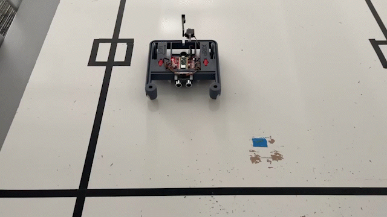

Stopping at a Line
==================

In the last module, you wrote and tested a function which could accurately 
determine if the reflectance sensor was able to see a line. In this activity, 
you'll use that function to make the robot stop when it sees a line.

    The XRP stopping when it sees a line.

Let's consider a previous exercise - using a while loop to drive a
certain distance:

.. tab-set::

    .. tab-item:: Python

        .. code-block:: python

            from XRPLib.defaults import *

            while drivetrain.get_left_encoder_position() < 20:
                drivetrain.set_speed(5, 5)
            drivetrain.stop()

        In this code, the condition being checked is
        ``drivetrain.get_left_encoder_position() < 20`` meaning that the robot will
        drive forward at 5 cm/s until the left encoder reads a distance of 20 cm. This 
        code can be easily modified to replace the current condition with a condition 
        that uses the function you wrote.
    
    .. tab-item:: Blockly

        .. image:: media/stop_at_distance.png
            :width: 300

        .. |ico1| image:: media/left_encoder_condition.png
            :height: 3ex

        In this code, the condition being checked is |ico1| meaning that the robot will
        drive forward at 5 cm/s until the left encoder reads a distance of 20 cm. This 
        code can be easily modified to replace the current condition with a condition 
        that uses the function you wrote.

.. admonition:: Try it out

    Modify the example code to use your function (``is_over_line()``) as the 
    condition for the loop.

    If you need to "invert" the value of your function (convert ``False`` to
    ``True`` and ``True`` to ``False``), you can use the ``not`` *operator*
    before calling your function like this: ``not is_over_line()``. This code
    does exactly what it sounds like: returns ``True`` when the robot is ``not``
    over the line.

Once you've tested your code and proved it to meet the challenge, make a new 
function called ``drive_until_line()`` and put your code in it. Don't delete 
this function, as you'll need it later!

Challenge activity
------------------

For an added challenge, try to write code which makes the robot capable of 
driving over and stopping at several lines. The robot should drive over a line,
stop for some amount of time, say two seconds, and then start driving again 
until it sees another line. This cycle should repeat forever.

.. tip:: 

    You'll need to write some logic which handles the robot driving *off* of the
    line too! Your code from the main activity might not be enough to handle
    this! Think about what your code would do if it started out *already on* a
    line.