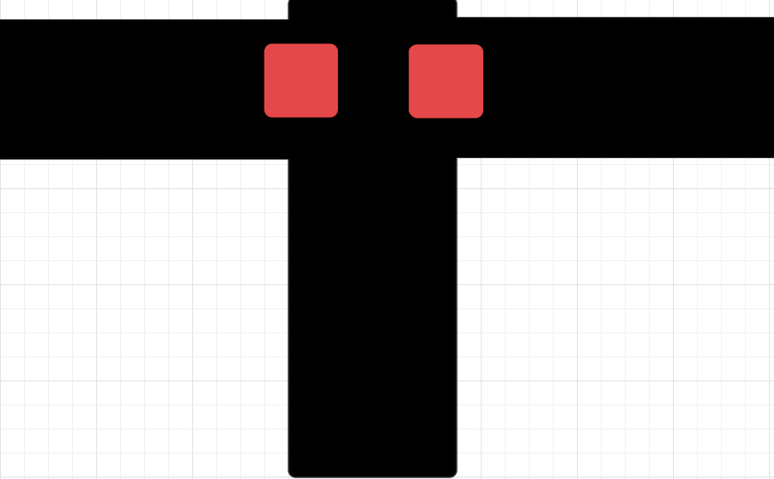

Stopping at an Intersection
===========================

With what you've learned in this module, you can now use proportional control to
drive your robot quickly and accurately along a line using both reflectance
sensors. However, smooth line following is not the only reason the XRP has two
sensors. Having two sensors also allows us to detect intersections between two
lines.

Consider this diagram from the last module:

.. figure:: media/p_control_2_sensors_centered.png
    :align: center

    Simplified diagram of the reflectance sensors centered on a line.

Notice how both reflectance sensors are mostly on the line, but not fully. Just 
like at the start of the module, you'll need to do some measurements of what the
line sensors read. This time, you'll need to see what they read when the robot 
is centered on the line. This is how the robot would be positioned on the line 
if it was following it accurately.

.. admonition:: Try it out

    Write an infinite loop to log the values from both line sensors using the
    webserver. Place your robot centered on the line and see what the values
    are.

Use the values you measure to determine a new threshold value. Note that this 
threshold will probably not be close to halfway between the white and black 
values, as your robot's sensors may not actually be centered perfectly on the 
edges of your line, as this depends on the width of the line you are using. A 
good value for this threshold would be about halfway between the value you just
measured and the maximum value you measured back in the first module.

.. tip:: 

    If you don't remember your sensor's maximum value, just place the robot 
    sideways on the line so that both line sensors are over the line. Use the 
    same code you just used to read the values again.

Consider what the line sensor would see when it crosses an intersection:

    Simplified diagram of the reflectance sensors over an intersection.

When crossing an intersection, the sensor sees nothing but black. This means 
that when **both sensors** see **completely black**, we can assume we are at an 
intersection.

.. admonition:: Try it out

    Write a function ``is_at_intersection()`` which reads the values of both 
    line sensors and returns ``True`` if the robot is at an intersection.

Now that you have a way to detect an intersection, it's time to tie everything 
together.

.. admonition:: Try it out

    Write a function ``follow_line_until_intersection()`` which runs your line
    following algorithm until an intersection is detected, and then stops the 
    robot.

Challenge
---------

Try writing code to turn at an intersection. Pick a direction to turn, and then 
have your robot turn that direction until it is over the other line of the 
intersection, and then start following that line

.. tip:: 

    You will need to have your robot's wheels centered over the intersection for
    this to work. Use one of the ``drivetrain`` functions to do this after you
    arrive at the intersection.