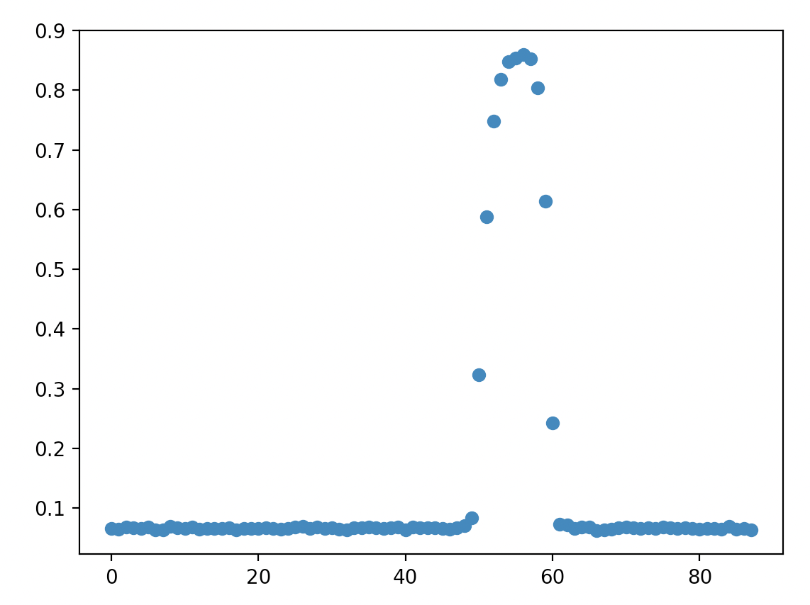

Understanding the line sensor
=============================

In the last module, you used the distance sensor to measure distances and make 
the XRP follow along a wall. The XRP has another sensor that allows it to 
navigate: the **line following sensor**.

The line following sensor consists of two "reflectance" sensors. Simply put, the
reflectance sensor shines a light at the ground and measures how much of the 
light is reflected back. The darker an object is, the less light it reflects.
The sensor uses infrared light, just like a TV remote, so the light is not 
visible to the human eye.

This sensor is perfect for sensing dark lines on a light background! If the 
sensor is on top of a dark line, less light will be reflected back, and if it is
not on a line, more light will be reflected back. You can use this information 
in your code to let the robot decide what to do in these situations.

The XRP has *two* reflectance sensors, a left sensor and a right sensor. If you
look at the bottom of your XRP on the sensor board, you will see the two
sensors. **S1** is the left sensor and **S2** is the right sensor. Later in the
module you will learn a way to use both sensors to follow lines very smoothly, 
For this lesson, we will only use the *right* sensor.

.. figure:: media/line_sensors.png
    :align: center

    The two reflectance sensors on the XRP.

**XRPLib** provides functions to read the values of the reflectance sensors:

.. code-block:: python

    from XRPLib.defaults import *

    # Reads the left sensor and stores the value in the variable "left"
    left = reflectance.get_left()

    # Reads the right sensor and stores the value in the variable "right"
    right = reflectance.get_right()

Before doing anything with a new sensor, you need to have a good understanding 
of the values it will give you in different conditions. For the reflectance 
sensor, it would be good to know what the sensor reports when it is completely 
off of the line (seeing a white surface), completely on the line (seeing a 
black surface), and some "middle of the road" values, when the sensor is half 
on the line and half off the line.

.. tip:: 

    Remember that for this exercise you should only be using the *right* line 
    sensor. Make sure that you center the correct part of the sensor board over
    the line when taking your measurements.

.. admonition:: Try it out

    Write code to read the value of the right reflectance sensor and use the
    webserver to log and graph the values in an infinite loop. Move the XRP
    around on a white surface with a line, and take note of the values the
    sensor reads in the different conditions above.

What do you notice from the values you measured? The documentation for the 
``reflectance`` module in **XRPLib** states that the ``get_left()`` and 
``get_right()`` functions return a number between 0 and 1. Did your values ever 
reach exactly 0 or exactly 1? Can you tell which range of numbers corresponds to
seeing white and which range of numbers corresponds to seeing black?

    Example graph of reflectance sensor data.

Above is an example graph of some data from the reflectance sensor. At around 
50 units on the X axis, the reflectance sensor was moved over a line (this data 
was recorded while the robot was driving across a line) and at around 60 units,
the reflectance sensor was moved back off of the line. Does your graph look 
similar to the one above?

.. note:: 

    Your graph will not look exactly the same as ours. No two reflectance 
    sensors are exactly the same, so it is important for you to take your own 
    measurements with your own robot.

It's good to experiment with the reflectance sensor to see what it does, but you
took this data for a reason. The line following sensor reports back a number, 
but what we'd really like it to tell us is whether it sees a line or not. To do 
this, you'll need to select a "threshold" value, where if the sensor reports a 
value greater than the threshold, we can confidently assume the sensor is seeing
a line, and if the sensor reports a value below the threshold, we can assume it 
is not seeing a line.

.. admonition:: Try it out

    Look at your graph and select a threshold value that makes sense to you.
    A number around halfway between the minimum and the maximum value you 
    measured is a good starting point.

    Write a function called ``is_over_line()`` which reads the value of the
    right reflectance sensor and returns ``True`` if the sensor sees a line
    (value above the threshold) or ``False`` if it does not. Don't delete this
    function when you're done, because you'll use it for the rest of the module!

    Use the webserver to log the result of calling your function in an infinite 
    loop. Move your robot around a surface with lines on it to make sure it 
    always returns the correct value based on what the sensor is seeing. If you 
    are getting incorrect values, adjust your threshold value.