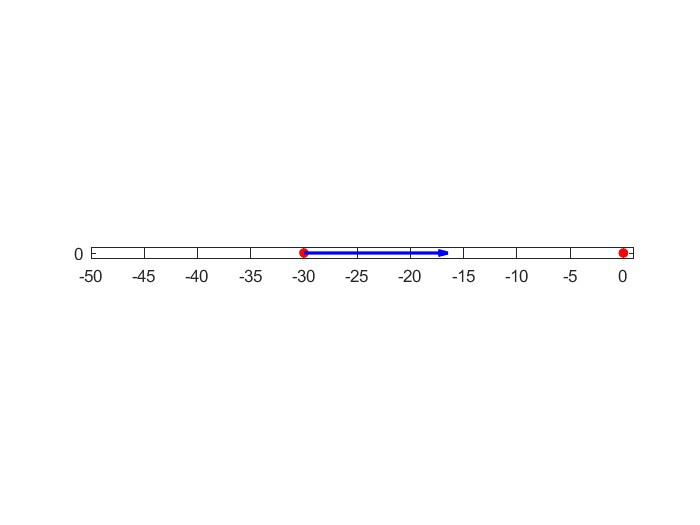
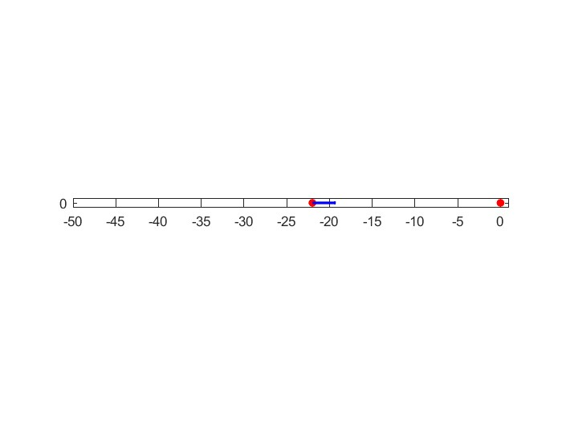
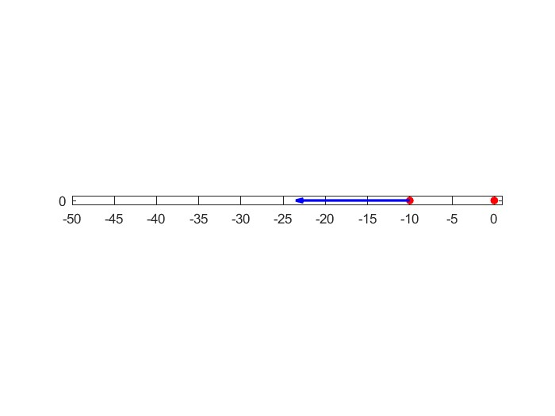

Controlling Behavior: Proportional Control
==========================================

Updating Behaviors:
-------------------

That worked! But it seemed like the robot went too fast when it needed to go slow, see how it overshoots, then keeps going back and forth? It doesn't seem to stop, does it?

[insert video]

How should we change that?

Let's go back to our Control Law.

.. list-table:: Title
   :widths: 50 50
   :header-rows: 1

   * - Sensor Input
     - Action

   * - You're a lot closer than **20 cm away**
     - Move Back
     	
   * - You're a little closer than **20 cm away**
     - Move Back
     
   * - You're **20 cm away**
     - No Need to Move
     
   * - You're a little farther than **20 cm away**	
     - Move Forward
     
   * - You're a lot farther than **20 cm away**
     - Move Forward

When we're closer, we don't have to go as fast, so let's change the table.

.. list-table:: Title
   :widths: 50 50
   :header-rows: 1

   * - Sensor Input
     - Action, (go forwards or backwards? Fast or slow?)

   * - You're a lot closer than **20 cm away**
   	(far away from the target)
     -
     	
   * - You're a little closer than **20 cm away**
   	(close to the target)
     - 
     
   * - You're **20 cm away**
   	(at the target)
     - 
     
   * - You're a little farther than **20 cm away**
   	(close to the target)
     - 
     
   * - You're a lot farther than **20 cm away**
	(far from the target)
     -   

.. image:: media/close2.jpg
  :width: 200
  :alt: Alternative text

This is called **proportional control**. The control effort is proportional to the error.

That means that if the error is large (you have to go a far distance), so is the control effort. If the error is negative (you have to go backwards), the control effort is in the other direction.

*Remember -- the error is the distance between the point you are at, and the point you want to go to.*

How do you find the distance on a number line like the one above? What is the error between "30" and "20"? How do you find it?

Implementing Proportional Control:
----------------------------------

If we set the control input **equal to** the **error**, we might be satisfied, right? After all, this would make the control become bigger when the error is bigger, and when the error is negative the control input would be negative. You would be telling the robot to drive backwards.

The control law used here would be :math:`effort = error` 

But the effort is capped at "1". If :math:`effort = 10`, then your effort would be too much, right? That is why in proportional control, you can **scale down** or **scale up** this control effort by an amount. This amount is called "the proportional constant" or :math:`k_{p}`.

**If you scaled the effort down by 15, what would the effort be (at error = 10)?**

In this case, :math:`k_{p}` would be :math:`\frac { 1 }{ 15 }`, and new control law would be :math:`effort = \frac { error }{ 15 }`, or :math:`effort = k_{p} * error`

Try implementing this control law on your robot. How did it work? what could be done to improve it? Remember, :math:`k_{p}` can be set to any **number** you want.
