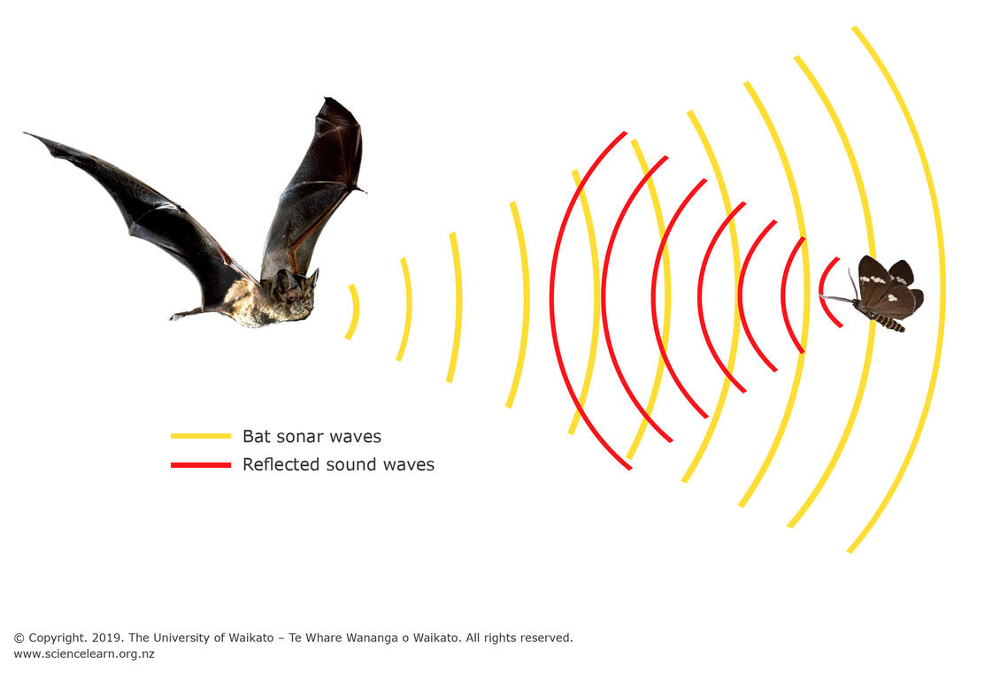

Measuring Distances
============================

Animal Echolocation
~~~~~~~~~~~~~~~~~~~~~~~

Information about our environment helps our robots perform complex tasks such as obstacle avoidance, navigation, and path planning. 

Similarly, animals like bats have evolved to use processes like echolocation which allow them to navigate through dark caves and find food where animals like bats emit high-frequency sound waves using their mouths. They listen to the echo of the sound waves bouncing back from the environment with their highly sensitive ears, allowing them to determine the size, shape, and texture of objects.

Robotic Echolocation
~~~~~~~~~~~~~~~~~~~~~

Just like bats, robots have evolved to have their own distance sensors which can give the robot more information about where it is relative to its environment. This allows the robot to make more informed decisions about how to navigate its environment.

So, what are some sensors that allow you to measure distances?

Reflective sensors
------------------

Lidar (Light Detection and Ranging), Sonar (Sound Navigation and Ranging), and Radar (Radio Detection and Ranging) all follow the same principle. These sensors all have one transmitter that "sends" a signal and a receiver that "listens" for the signal that was sent out. 

One common example is an ultrasonic range finder, which emits sound waves and listens for the echo. The sensor then calculates the distance based on the time it takes for the sound wave to bounce back.

.. tip::
  Since an ultrasonic range finder assumes that the sound waves will bounce back from a flat wall, pointing the range finder at an angled surface can lead to inaccurate readings. Try pointing the range finder at different surfaces and see how the readings change.

  How would you use this sensor to detect the distance to a wall that's angled? What information could you use about your environment to infer distances from angled/curved surfaces?

Mechanical Sensors
------------------

Another type of sensor that can directly inform the robot about distance are
mechanical sensors such as limit switches. These sensors operate by sensing
touching an object and can be used to detect when a robot has reached a certain
point in its environment.

These sensors work by completing a circuit, either using magnets or physical force. 

Completion of the circuit informs the robot that the actuator has reached a particularl
position.
For example, a limit switch can be used to detect when a robot has reached the end of a track.

Using the Ultrasonic Sensor
---------------------------

.. image:: media/setpointtarget.png

While using the XRP, your distance sensor will be an ultrasonic range finder. Here is the method call to get the distance from the sensor:

.. tab-set:: 

    .. tab-item:: Python

        .. code-block:: python

          rangefinder.distance()

    .. tab-item:: Blockly

        .. image:: media/sonardistance.png
            :width: 300
    
This function returns the distance, in cm, from the sensor to the nearest object.

.. note:: Try it out!
  Try writing code that checks the distance every 50 ms (0.05 seconds) and prints the output.

Here's the answer:

.. tab-set:: 

    .. tab-item:: Python

        .. code-block:: python

          from XRPLib.defaults import *
          import time

          while True:
            print(rangefinder.distance())
            time.sleep(0.05)

    .. tab-item:: Blockly

        .. image:: media/printsonardistance.png
            :width: 300