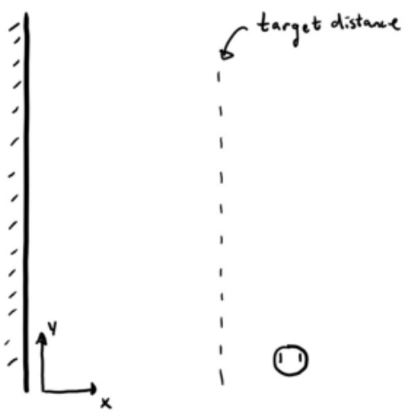

Wall Following
==============
Now that you've developed a program to keep a certain distance from an object, let's try to follow a wall at a certain distance.

Building a control law
----------------------
What do we want to do when we are too close to the wall? How do we start to move closer to the wall?

Here is a sketch of the setup:

 
.. tip::
   Remember that you will want to incorporate a "base effort" to ensure that the robot is moving forward at all times. Let's set this to "0.5".

   Also, depending on what side of the robot is facing the wall, you will want to slow down the wheel on the side that is closer to the wall to turn towards the wall.

Try implementing the control law you develop to follow the wall at a distance of 20 cm. Remember that you can tune "kp" and your "base effort" to make this controller better.

[insert video]

