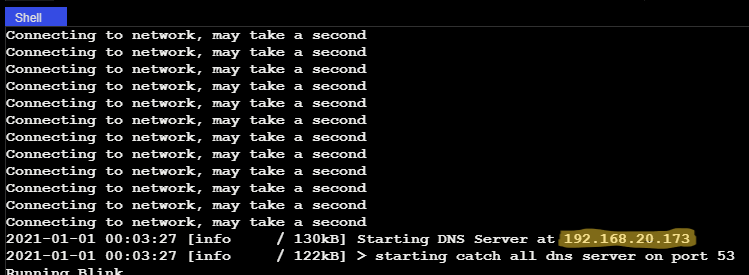

Using the XRP Webserver
=======================

Introduction:
-------------

In this section, you will learn about webservers and how to use them to wirelessly communicate with the XRP. 
A Webserver is a computer program that takes instructions from another computer over the internet. 
They are used to display web pages, run video games, send messages, and do almost anything else you can do on the internet.
Using the XRP's built-in Webserver, you can wirelessly display values on your computer and even send instructions to the XRP with 
just the press of a button. With this functionality you can easily debug programs and even use your phone or 
computer to remotely control your XRP.

Writing programs that use the webserver is simple. 
If you are using python, the webserver is included in your :code:`from XRPLib.defaults import *` call. If you are using blockly, this will be done for you as well.

Our webserver supports a bunch of useful logging and debugging tools you can use. 
This includes adding buttons to call functions that you write directly from the webserver, which allows for remote control of your robot,
or logging variables to the webserver as your program runs, allowing you to see your values change in real time.

For now, we will focus on the basics of using the webserver and getting it to start, 
and in the next section we will go over how to use its full functionality.

Starting the Webserver:
-----------------------

There are two main modes that the webserver can run in. The first is called "bridge mode", and the second is called "access point mode".
In bridge mode, the XRP will connect to your home wifi network and use that to communicate with your computer or mobile device.
In access point mode, the XRP will create its own wifi network that you can connect to with your computer or mobile device.

.. note::
    The XRP can only connect to 2.4GHz wifi networks. If you are using a 5GHz network, you will need to switch to a 2.4GHz network.

To start the webserver in bridge mode, you will need to know the name and password of your home wifi network. 
In the root directory of your robot, you will find a file called :code:`secrets.json`. 
This is where you can safely store your wifi network name and password to be used by the webserver. An example of this file can be seen here:

.. code-block:: json

    {
        "wifi_ssid": "YOUR_WIFI_SSID",
        "wifi_password": "YOUR_WIFI_PASSWORD",
        "robot_id": 1,
        "ap_ssid": "XRP {robot_id}",
        "ap_password": "remote.xrp"
    }

In this file, you will create a field called :code:`wifi_ssid` and :code:`wifi_password`. 
If you are using bridge mode, this is where you will put your wifi network name and password.
If you are using access point mode, you will need to use the :code:`ap_ssid` and :code:`ap_password` fields instead.
The :code:`robot_id` field can be used to give your robot a unique name when it is in access point mode, 
and will replace the :code:`"{robot_id}"` in the :code:`ap_ssid` field.
Using this json file is not necessary, and these fields can be later specified in either python or blockly.

Starting the webserver in access point mode is simple. 
All you have to do is call the :code:`start_network` function, followed by the :code:`start_server` function.
If you didn't configure the :code:`secrets.json` file, you will need to specify the access point name and password in the :code:`start_network` function.
Otherwise, you can leave these fields blank and the webserver will use the values from the :code:`secrets.json` file.

In bridge mode, it's almost exactly the same, except you will call the :code:`connect_to_network` function instead of the :code:`start_network` function.
Similarly, if you didn't configure the :code:`secrets.json` file, you will need to specify the network name and password here.

.. tab-set::

    .. tab-item:: Python

        .. code-block:: python

            webserver.start_network(ssid="XRP_{robot_id}", robot_id=15, password="remote.xrp")    
            webserver.start_server()

        OR

        .. code-block:: python

            webserver.connect_to_network(ssid="YOUR_NETWORK", password="YOUR_PASSWORD")
            webserver.start_server()

    .. tab-item:: Blockly

        .. image:: media/start-server.png
            :width: 600

        OR

        .. image:: media/connect-to-network.png
            :width: 700

If you are using access point mode, search for wifi networks on your phone or computer, and join the wifi network with the 
name and password you chose.

Finally, open a new page on your browser. In bridge mode you will have to navigate to the IP given when the webserver starts up (highlighted below).
You should see your new custom dashboard! For now, it will look pretty empty, but we will add more to it later.

.. note:: 
    Once you start the server, the XRP program takes control of program execution, and will not return until the webserver is stopped.
    Make sure that anything you want to do is done before you start the webserver. This may change in a future update.

Now you know how to start your web server. Next, you will learn how to use its full functionality. 